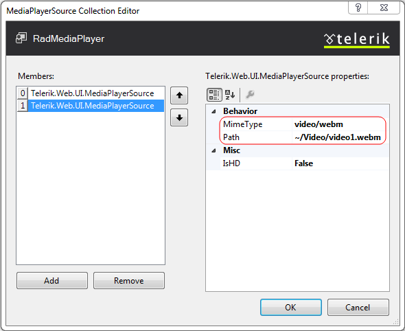

# Getting Started


**RadMediaPlayer** is a new addition to the Telerik's control kit for ASP.NET AJAX. And as a part of the UI bundle, it possesses the main feature of every rad control - provides the developer a useful and convenient tool designed for achieving fascinating results in a sharp time frame.


**RadMediaPlayer** can be used for presenting video and audio files from static sources or streaming online YouTube clips to enrich your web site with dynamic content in a user-friendly interface.

## Playing Video File

Configuring **RadMediaPlayer** is a quite straightforward and not time-consuming task once we know the proper steps to follow. The player uses the video and audio functionality provided by the browsers in accordance with the HTML5 standard, which means that the same format type requirements apply.

1. Drag a RadMediaPlayer control from the toolbox onto your Web page. Its [Smart Tag]() should appear automatically:


2. First, we need some sources. To be consistent with all of the major browsers supporting HTML5, we need to prepare different formats of the same video source. The browsers are capable to choose their "favorite" video format out of our source collection. Here is a short definition of the three supported formats and their compliance with the major browsers:

* **MP4** - MPEG 4 files with H264 video codec and AAC audio codec.

* **WebM** - WebM files with VP8 video codec and Vorbis audio codec.

* **Ogv** - Ogg files with Theora video codec and Vorbis audio codec.


|  **Browser**  |  **MP4**  |  **WebM**  |  **Ogv**  |
| ------ | ------ | ------ | ------ |
|Internet Explorer|YES|NO|NO|
|Chrome|YES|YES|YES|
|Firefox|YES|YES|YES|
|Opera|NO|YES|YES|

You can find additional and updated information about the supported HTML5 formats [here](http://www.w3schools.com/html/html5_video.asp).

3. Once we finish assembling our sources, it's time to add their respective MIME settings to the Web Config file of our web site:

````ASP.NET
<system.webServer>
  <staticContent>
    <mimeMap fileExtension=".mp4" mimeType="video/mp4" />
    <mimeMap fileExtension=".ogv" mimeType="video/ogg" />
    <mimeMap fileExtension=".webm" mimeType="video/webm" />
  </staticContent>
</system.webServer>
````


4. Next, we can add the main source files for the media player:


5. Making avail of the **MediaPlayerSource Collection Editor** we can add the rest of the videos and their HD versions respectively:


6. The settings we applied above can also be defined using the Properties window of the control, which can be displayed by right-clicking the RadMediaPlayer and choosing Properties from its context menu:


7. To conclude, we set the size of the player and we are ready to go:


## Playing Audio File

**RadMediaPlayer** also provides an effortless way of embedding audio files to your web sites:


Since the player is tightly dependent on the audio functionality provided by the browsers which support HTML5 standard, it requires multiple sources with different formats to work on cross-browser environment:


|  **Browser**  |  **MP3**  |  **Wav**  |  **Ogg**  |
| ------ | ------ | ------ | ------ |
|Internet Explorer|YES|NO|NO|
|Chrome|YES|YES|YES|
|Firefox|YES|YES|YES|
|Opera|NO|YES|YES|

You can find additional and updated information about the supported HTML5 formats [here](http://www.w3schools.com/html/html5_audio.asp).

Adding their respective MIME settings to the Web Config file of our web site can be done as follows:

````ASP.NET
<system.webServer>
  <staticContent>
    <mimeMap fileExtension=".mp3" mimeType="audio/mpeg" />
    <mimeMap fileExtension=".ogg" mimeType="audio/ogg" />
    <mimeMap fileExtension=".wav" mimeType="audio/wav" />
  </staticContent>
</system.webServer>
````


For configuring the remaining settings of the **RadMediaPlayer** please refer to the **Playing Video File** section above.

## Playing YouTube Video

You can easily enable users to play YouTube videos on your web site by including a RadMediaPlayer on your page and setting its source to the desired YouTube video link.
