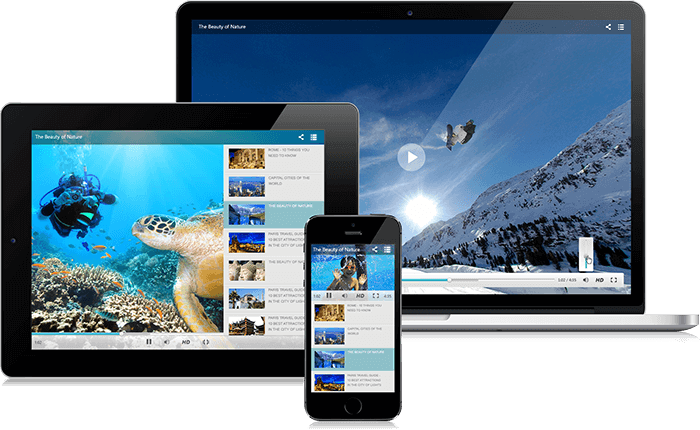

# Mobile Support Overview


## 

Telerik ASP.NET MediaPlayer comes with built-in adaptive behavior. When accessed via a mobile device, the control changes to create a user experience tailored to the device screen size. In this mode, **RadMediaPlayer** is mobile-friendly and its playback, time bar,volume and playlist features are easier to select and interact.

**Telerik Video Player for ASP.NET makes possible to handle touch events in the same manner as those triggered by a keyboard or a mouse.**


## Mobile vs Auto Render Modes

You can enable the mobile layout of the control by setting the **RenderMode** property of the media player to **Mobile**.

To cover the rendering of both mobile and desktop devices, you can set the **RenderMode** property to **Auto**. This option will automatically decide how to render the control on a smartphone, tablet or PC.

For more accurate device detection, you can reference the [Device Detection Framework](https://www.telerik.com/products/aspnet-ajax/device-detection-framework.aspx) , which ensures that the control is rendered with appropriate UI according to the device screen size.

## Viewport adjustment

For fine-tuning of the viewport you can add the following meta tag in the head section of the page.

````ASP.NET
	     <meta name="viewport" content="width=device-width, initial-scale=1" />
````


For optimal experience on mobile devices, we suggest that you use Telerik controls together with the [Page Layout Framework](https://www.telerik.com/products/aspnet-ajax/responsive-page-layout.aspx) , which will add responsive capabilities to your layout. See more mobile-optimized demos of Telerik controls in this responsive [sample app](https://demos.telerik.com/responsive-web-design-aspnet/samples.aspx).

## See Also

 * [Overview]()

 * [Live Demo](https://demos.telerik.com/aspnet-ajax/media-player/examples/overview/defaultcs.aspx)

 * [Getting Started]()
