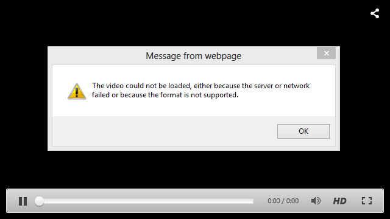
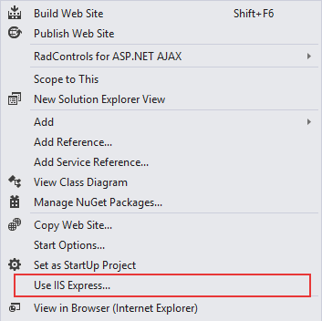

# Playing Video on IE

## 

While testing your **RadMediaPlayer** application on Internet Explorer, you can come across the following challenge.

**This video plays perfectly well in other browsers but causes an exception on IE.**

This problem is a general browser behavior and not Telerik specific. You will face the same problem with the standard video tag provided in [this article](http://www.w3schools.com/html/html5_video.asp).

## Reason

Most probably, you are using **Visual Studio Development Server** to run your web page. This development server does not have full mime map and returns **application/octet-stream** as the mime type of the video. However, IE does not recognize this mimetype and hence the playing malfunction.

## Solution

The good news is that this issue is nothing serious and the error will not arise if you host and run the site on IIS manager. Alternatively, you can run it by right clicking on the project and select **Use IIS Express**.

**On the context menu of your project there is an option for selecting the hosting environment.**

# See Also

 * [Overview]()

 * [Getting Started]()
