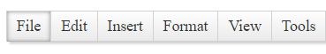

# Keyboard Support


A critical requirement for software accessibility is keyboard support as a complete alternative to pointing devices (mouse, etc.). Keyboard support is comprised of command key, focus key, and keyboard navigation. **RadMenu** seamlessly switches between mouse and keyboard navigation.

Setting the control's **KeyboardNavigationSettings** (*introduced in R2 2016 - ver.2016.2.504*), allows you to associate an activation combination (**CommandKey** + **FocusKey**), which moves focus directly to the **RadMenu** and enables keyboard navigation. When there are multiple **RadMenu** controls on a given page, each of them may have a different activation combination.

## Keyboard Navigation Settings

The **KeyboardNavigationSettings** exposes two properties to configure the keyboard combination that sets focus to the control:

* **CommandKey**: [Ctrl] , [Alt] or [Shift].

* **FocusKey**: An upper-case letter or number.

Pressing **CommandKey** + **FocusKey** sets the focus on the **RadMenu**'s first item and enables keyboard navigation.

>note Certain keyboard combinations are reserved and used as shortcuts in the browsers.
>

**Example:** Setting the **KeyboardNavigationSettings** for **RadMenu**

````ASP.NET
<telerik:RadMenu ID="RadMenu1" runat="server" RenderMode="Lightweight">
    <KeyboardNavigationSettings CommandKey="Alt" FocusKey="M" />
	<Items>
		<telerik:RadMenuItem Text="File" >
		</telerik:RadMenuItem>
		<telerik:RadMenuItem Text="Edit" >
		</telerik:RadMenuItem>
	</Items>
</telerik:RadMenu>
````

## Keyboard Navigation

* Focus the **RadMenu**'s first item by pressing **CommandKey** + **FocusKey**:

	

* Navigate the items using **Left** and **Right Arrow** keys:

	


* Expand the submenus using **Down** and **Up Arrow** keys:

	

If you do not provide a `TabIndex` value to match the rest of the page, RadMenu will render `tabindex="0"` so that its element is focusable. This also applies to individual menu items.

If you have not defined tab order in your page, you may want to remove the tabIndex of the menu. You can do this easily with JavaScript. For example:

````JavaScript
function removeMenuTabIndex() {
    $telerik.$(".RadMenu[tabindex=0]").removeAttr("tabindex");
    Sys.Application.remove_load(removeMenuTabIndex);
}
Sys.Application.add_load(removeMenuTabIndex);
````

If you are using **Q1 2016 SP** or a previous release of the **UI for ASP.NET AJAX** controls, an alternative to arrow keys for moving forward and backward among the menu items are the **TAB** and **SHIFT** + **TAB** key combinations:

* To move forward, use the **TAB** key.

* To move backward, use the **SHIFT** + **TAB** key combination.

### Expand Direction and Flow

The following properties are related to keyboard accessibility as they define the flow and expanding direction of menu items:

* **Flow** This property defines whether the menu (or submenu) is horizontal or vertical. The left and right arrow keys navigate horizontal menus, while the up and down keys navigate vertical menus. Similarly, in a horizontal menu, the up and down arrow keys expand the child items of a focused parent, whereas in a vertical menu, children are expanded using the left and right keys.

* **GroupSettings** Each **RadMenuItem** has a **GroupSettings** property that specifies how its child menu expands. Apart from setting the **Flow** property on the menu level, you can explicitly set the flow and the expanding direction for each particular menu item. The values you set at this level affect the selected item's children.

To learn more about the **Flow** and **ExpandDirection** properties, see [Controlling the Layout of Child Items]().

* Select a focused item and expand its submenu by pressing **Enter** or **Space bar**. As of **Q2 2016** release, sub-items list can also be expanded by using the **Space bar** key:


* Close an expanded submenu by pressing **Esc**:


# See Also

 * [RadMenu Item Builder]()
