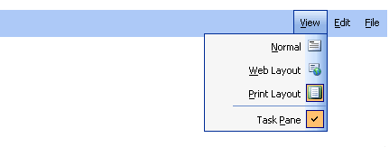

# RTL Support


## 

**RadMenu** includes support for right-to-left locales using the direction attribute. If you set **dir="rtl"** on the **RadMenu** objector to any parent HTML element, **RadMenu** reverses item order and aligns itself to the right side of its container:

````ASPNET
	    <telerik:RadMenu ID="RadMenu1" runat="server" Skin="Outlook" dir="rtl">
	        <Items>
	            <telerik:RadMenuItem Text="File" AccessKey="F">
	                <Items>
	                    <telerik:RadMenuItem ImageUrl="Images/11new.gif" Text="New" AccessKey="w" />
	                    <telerik:RadMenuItem ImageUrl="Images/12open.gif" Text="Open" AccessKey="O" />
	                    <telerik:RadMenuItem Text="Close" AccessKey="C" />
	                </Items>
	            </telerik:RadMenuItem>
	            <telerik:RadMenuItem Text="Edit" AccessKey="E">
	                <Items>
	                    <telerik:RadMenuItem ImageUrl="Images/21undo.gif" Text="Undo" AccessKey="U" />
	                    <telerik:RadMenuItem ImageUrl="Images/22copy.gif" Text="Copy" AccessKey="C" />
	                    <telerik:RadMenuItem ImageUrl="Images/24find.gif" Text="Find..." AccessKey="F" />
	                </Items>
	            </telerik:RadMenuItem>
	            <telerik:RadMenuItem Text="View" AccessKey="V">
	                <Items>
	                    <telerik:RadMenuItem ImageUrl="Images/31normal.gif" Text="Normal" AccessKey="N" />
	                    <telerik:RadMenuItem ImageUrl="Images/32web.gif" Text="Web Layout" AccessKey="W" />
	                    <telerik:RadMenuItem ImageUrl="Images/33print.gif" Text="Print Layout" AccessKey="P" />
	                    <telerik:RadMenuItem IsSeparator="True" />
	                    <telerik:RadMenuItem ImageUrl="Images/34task.gif" Text="Task Pane" AccessKey="p" />
	                </Items>
	            </telerik:RadMenuItem>
	        </Items>
	    </telerik:RadMenu>
````


This produces the following menu:



For a live example, see [Right to Left Support](http://demos.telerik.com/aspnet-ajax/Menu/Examples/Functionality/RightToLeft/DefaultCS.aspx).

# See Also

 * [Layout of Child Items]()

 * [Layout of Root Items ]()

 * [Setting  the CSS Class of Items]()

 * [Tutorial: Creating A Custom Skin]()

 * [Overview]()
