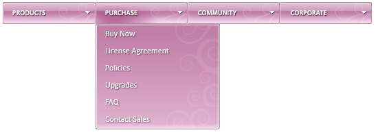

# Adding Images to Items

## 

Each **RadMenuItem** has a set of properties you can use to add images to your menu items. You can simply add a single image to each menu item, or you can add separate images that reflect the state of the menu item.

The image appears to the left of the menu item text (unless you are using a [right-to-left orientation](), in which case it appear to the right of the menu item text). By setting the **Text** property to an empty string, you can create menu items that consist solely of images.

The following properties let you add images to menu items:

* **ImageUrl** specifies an image that is added to the menu item. This image is always used, unless you set one of the other properties to specify an alternate image to use in a specific state.

* **HoveredImageUrl** specifies an image that is used when the mouse is over the menu item.

* **ImageClickedUrl** specifies an image that is used when the user clicks the menu item.

* **ExpandedImageUrl** specifies an image that is used when the list of child items is showing.

* **DisabledImageUrl** specifies an image that is used when the item is disabled.

To set the image properties at design time, use the [RadMenu Item Builder]().

The following example uses the **ImageUrl** and **HoveredImageUrl** properties to create a **RadMenu** that uses only images for items:

````ASP.NET
<telerik:radmenu id="RadMenu1" runat="server" skin="" flow="Horizontal">
	<Items>
	  <telerik:RadMenuItem
	     ImageUrl="Images/Products.gif"
	     HoveredImageUrl="Images/ProductsOver.gif"
	     ToolTip="Products">
	   <Items>
	     <telerik:RadMenuItem
	        ImageUrl="Images/Products/RadControlsClassic.gif"
	        HoveredImageUrl="Images/Products/RadControlsClassicOver.gif"
	        ToolTip="RadControls Classic" />
	     <telerik:RadMenuItem
	        ImageUrl="Images/Products/RadControls.gif"
	        HoveredImageUrl="Images/Products/RadControlsprometheusOver.gif"
	        ToolTip="RadControls for ASP.NET AJAX Q3 2008" />
	     <telerik:RadMenuItem
	        ImageUrl="Images/Products/RadControlsWinforms.gif"
	        HoveredImageUrl="Images/Products/RadControlsWinformsOver.gif"
	        ToolTip="RadControls for Winforms" />
	     <telerik:RadMenuItem
	        ImageUrl="Images/Products/Reporting.gif"
	        HoveredImageUrl="Images/Products/ReportingOver.gif"
	        ToolTip="Reporting" />
	     <telerik:RadMenuItem
	        ImageUrl="Images/Products/RadControlsDNN.gif"
	        HoveredImageUrl="Images/Products/RadControlsDNNOver.gif"
	        ToolTip="RadControls for DNN" />
	     <telerik:RadMenuItem
	        ImageUrl="Images/Products/RadControlsSilverlight.gif"
	        HoveredImageUrl="Images/Products/RadControlsSilverlightOver.gif"
	        ToolTip="RadControls for Silverlight" />
	   </Items>
	 </telerik:RadMenuItem>
	 <telerik:RadMenuItem
	     ImageUrl="Images/Purchase.gif"
	     HoveredImageUrl="Images/PurchaseOver.gif"
	     ToolTip="Purchase">
	   <Items>
	      <telerik:RadMenuItem
	        ImageUrl="Images/Purchase/BuyNow.gif"
	        HoveredImageUrl="Images/Purchase/BuyNowOver.gif"
	        ToolTip="Buy Now" />
	      <telerik:RadMenuItem
	        ImageUrl="Images/Purchase/LicenseAgreement.gif"
	        HoveredImageUrl="Images/Purchase/LicenseAgreementOver.gif"
	        ToolTip="License Agreement" />
	      <telerik:RadMenuItem
	        ImageUrl="Images/Purchase/Policies.gif"
	        HoveredImageUrl="Images/Purchase/PoliciesOver.gif"
	        ToolTip="Policies" />
	      <telerik:RadMenuItem
	        ImageUrl="Images/Purchase/Upgrades.gif"
	        HoveredImageUrl="Images/Purchase/UpgradesOver.gif"
	        ToolTip="Upgrades" />
	      <telerik:RadMenuItem
	        ImageUrl="Images/Purchase/FAQ.gif"
	        HoveredImageUrl="Images/Purchase/FAQOver.gif"
	        ToolTip="Freqently Asked Questions" />
	      <telerik:RadMenuItem
	        ImageUrl="Images/Purchase/ContactSales.gif"
	        HoveredImageUrl="Images/Purchase/ContactSalesOver.gif"
	        ToolTip="Contact Sales" />
	   </Items>
	 </telerik:RadMenuItem>
	 <telerik:RadMenuItem
	     ImageUrl="Images/Community.gif"
	     HoveredImageUrl="Images/CommunityOver.gif"
	     ToolTip="Community">
	   <Items>
	     <telerik:RadMenuItem
	       ImageUrl="Images/Community/WhitePapers.gif"
	       HoveredImageUrl="Images/Community/WhitePapersOver.gif"
	       ToolTip="White Papers" />
	     <telerik:RadMenuItem
	       ImageUrl="Images/Community/LearningResources.gif"
	       HoveredImageUrl="Images/Community/LearningResourcesOver.gif"
	       ToolTip="Learning Resources" />
	     <telerik:RadMenuItem
	       ImageUrl="Images/Community/TelerikLabs.gif"
	       HoveredImageUrl="Images/Community/TelerikLabsOver.gif"
	       ToolTip="Telerik Labs" />
	   </Items>
	 </telerik:RadMenuItem>
	 <telerik:RadMenuItem
	     ImageUrl="Images/Corporate.gif"
	     HoveredImageUrl="Images/CorporateOver.gif"
	     ToolTip="Corporate">
	   <Items>
	     <telerik:RadMenuItem
	       ImageUrl="Images/Corporate/CorporateInfo.gif"
	       HoveredImageUrl="Images/Corporate/CorporateInfoOver.gif"
	       ToolTip="Corporate Info" />
	     <telerik:RadMenuItem
	       ImageUrl="Images/Corporate/ContactUs.gif"
	       HoveredImageUrl="Images/Corporate/ContactUsOver.gif"
	       ToolTip="Contact Us" />
	   </Items>
	 </telerik:RadMenuItem>
	</Items>
</telerik:radmenu>
````




For a live example, see [Image Only](http://demos.telerik.com/aspnet-ajax/Menu/Examples/Appearance/ImageOnly/DefaultCS.aspx).

Since Q3 2010 RadMenu provides support for sprites - two new properties have been added:EnableImageSprites for the whole menu and EnableImageSprite for every menu item. Their purpose is to replace the menu item image element with a sized span for easier use of sprites. CssClass property of the buttons should be set in order to apply the sprite background image:

````ASP.NET
<style type="text/css">
    .icon1 .rmLeftImage, .icon2 .rmLeftImage
    {
        background: transparent url('sprite.png') 0 0;
    }
    .icon2 .rmLeftImage
    {
        background-position: -16px 0;
    }
</style>

<telerik:RadMenu RenderMode="Lightweight" id="RadMenu1" runat="server" enableimagesprites="true">
   <Items>
       <telerik:RadMenuItem Text="Item1" CssClass="icon1" />
       <telerik:RadMenuItem Text="Item2" CssClass="icon2" />
       <telerik:RadMenuItem Text="Item3" EnableImageSprite="false" />
   </Items>
</telerik:RadMenu>
````


will be rendered like this:

````HTML
<ul class="rmRootGroup rmHorizontal">
    <li class="rmItem rmFirst">
        <a href="#" class="rmLink rmRootLink icon1">
            <span title="" class="rmLeftImage"></span>
            <span class="rmText">Item1</span> 
        </a>
    </li>
    <li class="rmItem ">
        <a href="#" class="rmLink rmRootLink icon2">
            <span title="" class="rmLeftImage"></span>
            <span class="rmText">Item2</span> 
        </a>
    </li>
    <li class="rmItem rmLast">
        <a href="#" class="rmLink rmRootLink">
            <span class="rmText">Item3</span> 
        </a>
   </li>
</ul>
````

>caution Setting ImageUrl overrides this behavior, so it should be removed for EnableImageSprite/s to work.
>


# See Also

 * [Layout of Root Items ]()

 * [Appearance Skins]()

 * [Overview]()

 * [Setting  the CSS Class of Items]()
