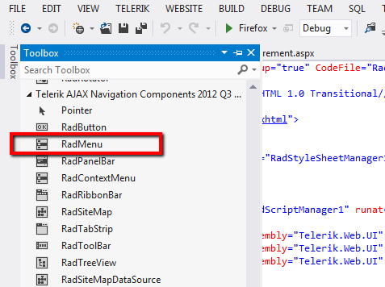
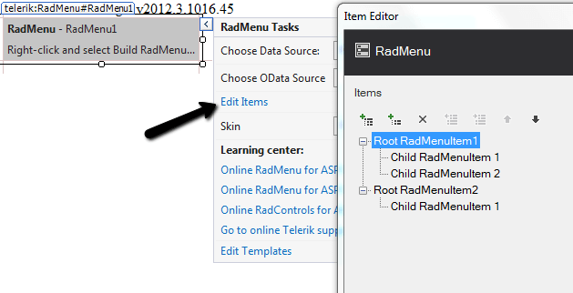
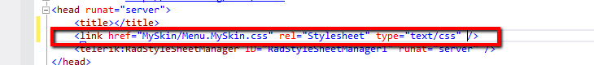
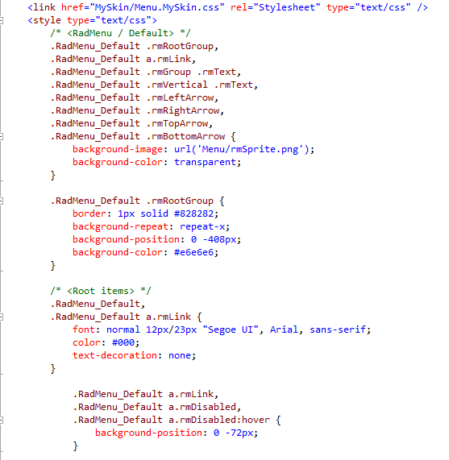
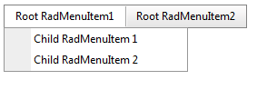
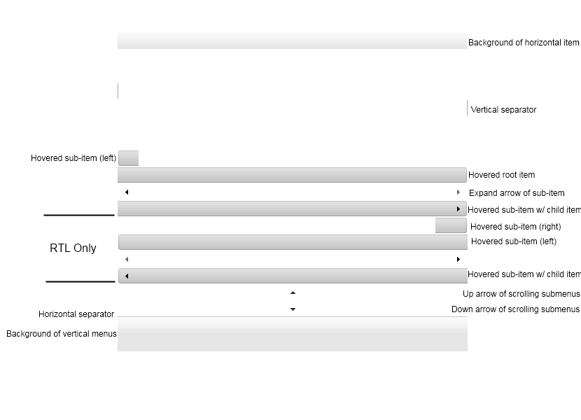

# Prepare the Project

1. Create a new Web site using Visual Studio.

1. Drag and drop a RadMenu control.
	

1. Add RadScriptManager.

1. Build RadMenu control.
	
	
# Prepare the External Skin and Image Folder
	
1. Create a new folder called *MySkin*

1. Copy the *Menu* folder that contains the sprite images of the RadMenu control and paste it to the *Myskin* folder.

1. Copy the *Menu.Default.css* style sheet file and place it in the *MySkin* folder.
	>note With the default installation of the ASP.NET AJAX control the file path will typically be similar to this example: \Program Files\Telerik\<Your Version of RadControls for ASPNET>\Skins\ Default.
	
1. Change the name of the file *Menu.Default.css* file to *Menu.MySkin.css*.

1. Drag and drop the *Menu.MySkin.css* file from the Solution Explorer onto your Web page.
	
	
1. Set the **EnableEmbeddedSkins** property of the RadMenu control to *False*.

1. Change the **Skin** property of your RadMenu control to *"MySkin"*.

1. Open the *Menu.Default.css* and replace all of the *sRadMenu_ Default* instances with *RadMenu_MySkin* and save the file.
	
	
1. Run the application. The new *"MySkin"* skin looks just like the *Default* skin:
	

# Getting Straight to the Point - Altering the Sprite Image and Changing the Background of the RadMenu

Now that we have an external skin of our own, we can start changing it to fit our needs. Get the *rmSprite.png* image and alter it as desired. For example since you will simply need to change the background color of the RadMenu control, using Photoshop you can just place an additional layer over the existing sprite image and easily create the new appearance. Here is how your new sprite image looks like:


Here is a descriptive explanation of the sprite image that is used for the RadMenu control. In general all of the sprites for the RadMenu follow a very similar pattern therefore no matter which sprite image we will take the states will very similar if not identical to the image below.

# Specificity Wars (some advanced techniques)

**Q:** How to change the white color when a RootItem is clicked or hovered?

**A:** Locate the following css selector(s) and simply change the background-color as desired:

````CSS
 /* applied when the RootItem is expanded */
    .RadMenu_MySkin a.rmExpanded,
    .RadMenu_MySkin a.rmExpanded:hover {
                background-color: red;
        }

/* applied when the RootItem is focused, selected or hovered */ 
    .RadMenu_MySkin a.rmLink:hover,
    .RadMenu_MySkin a.rmFocused,
     .RadMenu_MySkin a.rmSelected {
               background-color: blue;
        }
````

# See Also

 * [Creating a Simple Context Menu]()

 * [RadMenu and RadContextMenu Objects]()
