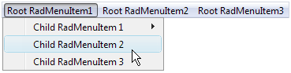
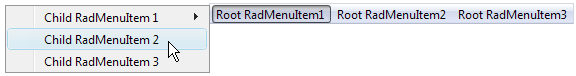
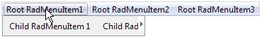
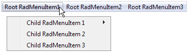

# Layout of Child Items


## 

By default, when the user expands a menu item from a horizontal layout, the child items appear immediately below it, stacked vertically. When the user expands a menu item from a vertical layout, the child items appear immediately beside it, stacked vertically:


You can change this default layout of child items using the __GroupSettings__ property of the parent item. To access the __GroupSettings__ property at design time, select the item in the [RadMenu Item Builder]().

__GroupSettings__ is a composite property, with the following sub-properties:

* __ExpandDirection__ determines where the list of child items appears relative to the parent item.

* __Auto__ (the default) causes child items to inherit the expand direction that applied to the parent item.

* __Up__ causes child items to appear above the parent item:

* __Down__ causes child items to appear below the parent item:

* __Left__ causes child items to appear to the left of the parent item:

* __Right__ causes child items to appear to the right the parent item:

>note By default, if the specified __ExpandDirection__ would cause items to cross a screen boundary, the list of child items appears in the opposite direction from the one specified. You can override this behavior by setting the __EnableScreenBoundaryDetection__ property to __False__ .
>


* __Flow__ controls how the child items are stacked.

* When __Flow__ is __Vertical__ (the default) child items appear on top of each other:

* When __Flow__ is __Horizontal__, child items appear beside each other

* __Height__ and __Width__ control the height and width of the area in which the child items can expand. When __Flow__ is __Vertical__, and __Height__ is too small to fit all items, the list of items becomes scrollable:

Similarly, when __Flow__ is __Horizontal__, and __Width__ is too small to fit all items, the list of items becomes scrollable:



* __OffsetX__ and __OffsetY__ are the offsets, in pixels, of the child items from the parent item. Setting these sub-properties lets you specify a gap between the parent item and its child items:

The following __RadMenu__ declaration shows how the __GroupSettings__ is attached to the parent menu item. It gives all items that have children an __ExpandDirection__ of __Down__, a __Flow__ of __Horizontal__, and an __OffsetX__ of 10 pixels:

````ASPNET
	    <telerik:RadMenu ID="RadMenu1" runat="server" Flow="Horizontal" Skin="Vista">
	        <Items>
	            <telerik:RadMenuItem runat="server" Text="Root Item 1">
	                <Items>
	                    <telerik:RadMenuItem runat="server" Text="Child Item 1.1">
	                        <GroupSettings ExpandDirection="Down" Flow="Horizontal" OffsetX="10" />
	                        <Items>
	                            <telerik:RadMenuItem runat="server" Text="Child Item 1.1.1">
	                                <GroupSettings ExpandDirection="Auto" Flow="Vertical" />
	                            </telerik:RadMenuItem>
	                            <telerik:RadMenuItem runat="server" Text="Child Item 1.1.2">
	                                <GroupSettings ExpandDirection="Auto" Flow="Vertical" />
	                            </telerik:RadMenuItem>
	                        </Items>
	                    </telerik:RadMenuItem>
	                    <telerik:RadMenuItem runat="server" Text="Child Item 1.2">
	                        <GroupSettings ExpandDirection="Auto" Flow="Vertical" />
	                    </telerik:RadMenuItem>
	                    <telerik:RadMenuItem runat="server" Text="Child Item 1.3">
	                        <GroupSettings ExpandDirection="Auto" Flow="Vertical" />
	                    </telerik:RadMenuItem>
	                </Items>
	                <GroupSettings ExpandDirection="Down" Flow="Horizontal" OffsetX="10" />
	            </telerik:RadMenuItem>
	            <telerik:RadMenuItem runat="server" Text="Root Item 2">
	                <Items>
	                    <telerik:RadMenuItem runat="server" Text="Child Item 2.1">
	                        <GroupSettings ExpandDirection="Auto" Flow="Vertical" />
	                    </telerik:RadMenuItem>
	                    <telerik:RadMenuItem runat="server" Text="Child Item 2.2">
	                        <GroupSettings ExpandDirection="Auto" Flow="Vertical" />
	                    </telerik:RadMenuItem>
	                </Items>
	                <GroupSettings ExpandDirection="Down" Flow="Horizontal" OffsetX="10" />
	            </telerik:RadMenuItem>
	        </Items>
	    </telerik:RadMenu>
````


This produces the following menu:


* The __RepeatColumns__ property specifies the number of columns. (added in Q3 2009)

* The __RepeatDirection__ property determines the order in which the items are rendered. (added in Q3 2009)

# See Also

 * [Layout of Root Items ]()

 * [Structure]()

 * [Overview]()

 * [RTL Support]()
