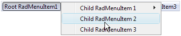
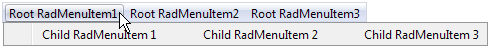
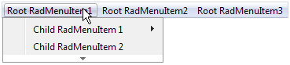

# Layout of Child Items

## 

By default, when the user expands a menu item from a horizontal layout, the child items appear immediately below it, stacked vertically. When the user expands a menu item from a vertical layout, the child items appear immediately beside it, stacked vertically:


You can change this default layout of child items using the **GroupSettings** property of the parent item. To access the **GroupSettings** property at design time, select the item in the [RadMenu Item Builder]().

**GroupSettings** is a composite property, with the following sub-properties:

* **ExpandDirection** determines where the list of child items appears relative to the parent item.

* **Auto** (the default) causes child items to inherit the expand direction that applied to the parent item.

* **Up** causes child items to appear above the parent item:

* **Down** causes child items to appear below the parent item:

* **Left** causes child items to appear to the left of the parent item:

* **Right** causes child items to appear to the right the parent item:

>note By default, if the specified **ExpandDirection** would cause items to cross a screen boundary, the list of child items appears in the opposite direction from the one specified. You can override this behavior by setting the **EnableScreenBoundaryDetection** property to **False** .
>


* **Flow** controls how the child items are stacked.

* When **Flow** is **Vertical** (the default) child items appear on top of each other:

* When **Flow** is **Horizontal**, child items appear beside each other

* **Height** and **Width** control the height and width of the area in which the child items can expand. When **Flow** is **Vertical**, and **Height** is too small to fit all items, the list of items becomes scrollable:

Similarly, when **Flow** is **Horizontal**, and **Width** is too small to fit all items, the list of items becomes scrollable:


* **OffsetX** and **OffsetY** are the offsets, in pixels, of the child items from the parent item. Setting these sub-properties lets you specify a gap between the parent item and its child items:

The following **RadMenu** declaration shows how the **GroupSettings** is attached to the parent menu item. It gives all items that have children an **ExpandDirection** of **Down**, a **Flow** of **Horizontal**, and an **OffsetX** of 10 pixels:

````ASP.NET
<telerik:RadMenu RenderMode="Lightweight" ID="RadMenu1" runat="server" Flow="Horizontal" Skin="Vista">
    <Items>
        <telerik:RadMenuItem runat="server" Text="Root Item 1">
            <Items>
                <telerik:RadMenuItem runat="server" Text="Child Item 1.1">
                    <GroupSettings ExpandDirection="Down" Flow="Horizontal" OffsetX="10" />
                    <Items>
                        <telerik:RadMenuItem runat="server" Text="Child Item 1.1.1">
                            <GroupSettings ExpandDirection="Auto" Flow="Vertical" />
                        </telerik:RadMenuItem>
                        <telerik:RadMenuItem runat="server" Text="Child Item 1.1.2">
                            <GroupSettings ExpandDirection="Auto" Flow="Vertical" />
                        </telerik:RadMenuItem>
                    </Items>
                </telerik:RadMenuItem>
                <telerik:RadMenuItem runat="server" Text="Child Item 1.2">
                    <GroupSettings ExpandDirection="Auto" Flow="Vertical" />
                </telerik:RadMenuItem>
                <telerik:RadMenuItem runat="server" Text="Child Item 1.3">
                    <GroupSettings ExpandDirection="Auto" Flow="Vertical" />
                </telerik:RadMenuItem>
            </Items>
            <GroupSettings ExpandDirection="Down" Flow="Horizontal" OffsetX="10" />
        </telerik:RadMenuItem>
        <telerik:RadMenuItem runat="server" Text="Root Item 2">
            <Items>
                <telerik:RadMenuItem runat="server" Text="Child Item 2.1">
                    <GroupSettings ExpandDirection="Auto" Flow="Vertical" />
                </telerik:RadMenuItem>
                <telerik:RadMenuItem runat="server" Text="Child Item 2.2">
                    <GroupSettings ExpandDirection="Auto" Flow="Vertical" />
                </telerik:RadMenuItem>
            </Items>
            <GroupSettings ExpandDirection="Down" Flow="Horizontal" OffsetX="10" />
        </telerik:RadMenuItem>
    </Items>
</telerik:RadMenu>
````

This produces the following menu:


* The **RepeatColumns** property specifies the number of columns. (added in Q3 2009)

* The **RepeatDirection** property determines the order in which the items are rendered. (added in Q3 2009)

# See Also

 * [Layout of Root Items ]()

 * [Structure]()

 * [Overview]()

 * [RTL Support]()
