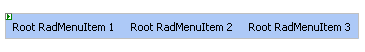
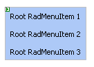
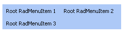
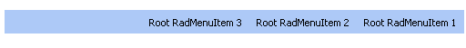

# Layout of Root Items 

There are a number of ways you can customize the look & feel of your __RadMenu__ control:

## Layout

Use the __Flow__ property to control the basic orientation of the menu. Flow can be __Horizontal__ (the default):

or __Vertical__:

* Use the __Height__ and __Width__ properties to limit the dimensions of the menu. If the __Width__ of a horizontal menu is too small to display all of its root items, the menu automatically creates additional rows:

* Use the __GroupSettings__ property of a __RadMenuItem__ object to [control the layout of its child items]().

* Add [separators]() to a list of items by creating an item with the __IsSeparator__ property set to __True__.

* Use the __dir="rtl"__ attribute to give the menu a [right-to-left orientation]():

## Look and Feel

* To change the overall look and feel of the combobox, set the [Skin]() property.

* To change the way the child menu items appear or disappear, use [Animations]().

* To change the look of an individual item in the menu, including reflecting the item's state, [use a CSS class property]().

* Use the item properties to [add images to items]().

* Use [templates]() to add controls to menu items.

* Use [RepeatColumns]() property to enable the multi-column menu.

# See Also

 * [Overview]()

 * [Showing the Path to an Item]()
