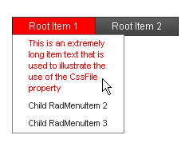

# Setting  the CSS Class of Items


**RadMenuItem** objects have a number of properties whose value is the name of a CSS class. These properties let you alter the appearance of individual items in the menu without [using a custom skin]().

The CSS class properties are

* **CssClass**: controls the appearance of the item in all states.

* **ClickedCssClass**: controls the appearance of the item when it has been clicked. The default value is **rmClicked**.

* **DisabledCssClass**: controls the appearance of the item when it is disabled. The default value is **rmDisabled**.

* **ExpandedCssClass**: controls the appearance of the item when its children are showing. The default value is **rmExpanded**.

* **FocusedCssClass**: controls the appearance of the item when it has keyboard or mouse focus. The default value is **rmFocused**.

* **SelectedCssClass**: controls the appearance of the item (the &lt;a&gt; tag) when the item is selected. The default value is **rmSelected**.

* **OuterCssClass**: controls the appearance of the item (the outer &lt;li&gt; tag).

>caution There is no CSS class property for items in the hovered state (when the mouse is over the item). To change the appearance of the hovered state for an item, define a rule for your new CssClass with the **:hover** modifier (see below).
>


To set the CSS class properties of an item at design time, use the [RadMenu Item Builder]().

>note The CSS class of an item is applied to the anchor (&lt;a&gt;) tag that represents the item in the rendered HTML output. For more information about the rendered output of **RadMenu** , see [Understanding the Skin CSS File]().
>


## Using CssClass

Consider a menu with an item that is very long. By default, **RadMenu** expands to display the entire text of the item on a single line, even if you set the **Width** property of the item:


You can use a small CSS class with the **white-space:normal** attribute to change the item so that it wraps to a specified width:

1. Add the CSS class definition to the <head> section of your Web page:

````ASPNET
<head runat="server">
    <title>Untitled Page</title>
    <style>
        .WrappingItem
        {
            white-space: normal;
        }
    </style>
</head>
````

1. Set the **CssClass** property of any items with long text to your new class:

````ASPNET
<telerik:RadMenu ID="RadMenu1" runat="server" Flow="Horizontal">
    <Items>
        <telerik:RadMenuItem runat="server" ExpandMode="ClientSide" Text="Root Item 1">
            <GroupSettings ExpandDirection="Auto" Flow="Vertical" />
            <Items>
                <telerik:RadMenuItem runat="server" ExpandMode="ClientSide" Text="This is an extremely long item text that is used to illustrate the use of the CssFile property"
                    CssClass="WrappingItem">
                    <GroupSettings ExpandDirection="Auto" Flow="Vertical" />
                </telerik:RadMenuItem>
                <telerik:RadMenuItem runat="server" ExpandMode="ClientSide" Text="Child RadMenuItem 2">
                    <GroupSettings ExpandDirection="Auto" Flow="Vertical" />
                </telerik:RadMenuItem>
                <telerik:RadMenuItem runat="server" ExpandMode="ClientSide" Text="Child RadMenuItem 3">
                    <GroupSettings ExpandDirection="Auto" Flow="Vertical" />
                </telerik:RadMenuItem>
            </Items>
        </telerik:RadMenuItem>
        <telerik:RadMenuItem runat="server" ExpandMode="ClientSide" Text="Root Item 2">
            <GroupSettings ExpandDirection="Auto" Flow="Vertical" />
            <Items>
                <telerik:RadMenuItem runat="server" ExpandMode="ClientSide" Text="This is another very long item."
                    CssClass="WrappingItem">
                    <GroupSettings ExpandDirection="Auto" Flow="Vertical" />
                </telerik:RadMenuItem>
            </Items>
        </telerik:RadMenuItem>
    </Items>
</telerik:RadMenu>
````


1. Run the application. Note that the text now wraps for items with the **WrappingItem** CSS class:

## Using ExpandedCssClass

This continues the previous example to show how to change the appearance of items when they are in a special state.

1. Add a new CSS class to your header to change the background of an item to red:

````ASPNET
<head runat="server">
    <title>Untitled Page</title>
    <style>
        .WrappingItem
        {
            white-space: normal;
        }
        .RedItem
        {
            background-color: red;
        }
    </style>
</head>
````


1. Set the **ExpandedCssClass** property of all root level items to the new CSS class:

````ASPNET
<telerik:RadMenu ID="RadMenu1" runat="server" Flow="Horizontal">
    <Items>
        <telerik:RadMenuItem runat="server" ExpandMode="ClientSide" Text="Root Item 1" ExpandedCssClass="RedItem">
            <Items>
                <telerik:RadMenuItem runat="server" ExpandMode="ClientSide" Text="This is an extremely long item text that is used to illustrate the use of the CssFile property"
                    CssClass="WrappingItem">
                    <GroupSettings ExpandDirection="Auto" Flow="Vertical" />
                </telerik:RadMenuItem>
                <telerik:RadMenuItem runat="server" ExpandMode="ClientSide" Text="Child RadMenuItem 2">
                    <GroupSettings ExpandDirection="Auto" Flow="Vertical" />
                </telerik:RadMenuItem>
                <telerik:RadMenuItem runat="server" ExpandMode="ClientSide" Text="Child RadMenuItem 3">
                    <GroupSettings ExpandDirection="Auto" Flow="Vertical" />
                </telerik:RadMenuItem>
            </Items>
            <GroupSettings ExpandDirection="Auto" Flow="Vertical" />
        </telerik:RadMenuItem>
        <telerik:RadMenuItem runat="server" ExpandMode="ClientSide" Text="Root Item 2" ExpandedCssClass="RedItem">
            <GroupSettings ExpandDirection="Auto" Flow="Vertical" />
            <Items>
                <telerik:RadMenuItem runat="server" ExpandMode="ClientSide" Text="This is another very long item."
                    CssClass="WrappingItem">
                    <GroupSettings ExpandDirection="Auto" Flow="Vertical" />
                </telerik:RadMenuItem>
            </Items>
        </telerik:RadMenuItem>
    </Items>
</telerik:RadMenu>
````


1. Run the application again. Expand an item and see the new appearance:

## Modifying the CSS class for hovered items

There is no property to specify a CSS class for hovered items. To customize the appearance of an item when the mouse hovers over it, you must modify the CSS class that you have applied to the item.

1. Add a new CSS rule for your WrappingItem CSS class:

````ASPNET
<head runat="server">
    <title>Untitled Page</title>
    <style>
        .WrappingItem
        {
            white-space: normal;
        }
        .WrappingItem:hover
        {
            color: red !important;
            background-color: white !important;
        }
        .RedItem
        {
            background-color: red !important;
        }
    </style>
</head>
````

>note Note the use of the **!important** modifier on the new CSS rule. This is to force the new rule to override any more specific CSS rules for hovered items in the CSS file for the skin.Without the **!important** modifier, the new CSS rule would not take effect.
>


1. Run the application again. This time, the items with CSSClass set to "WrappingItem" show the new appearance when the mouse hovers over them. The items without the "WrappingItem" class use the normal hovered appearance. 
>caption 



# See Also

 * [Layout of Root Items ]()

 * [Adding Images to Items]()

 * [Overview]()
