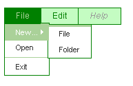
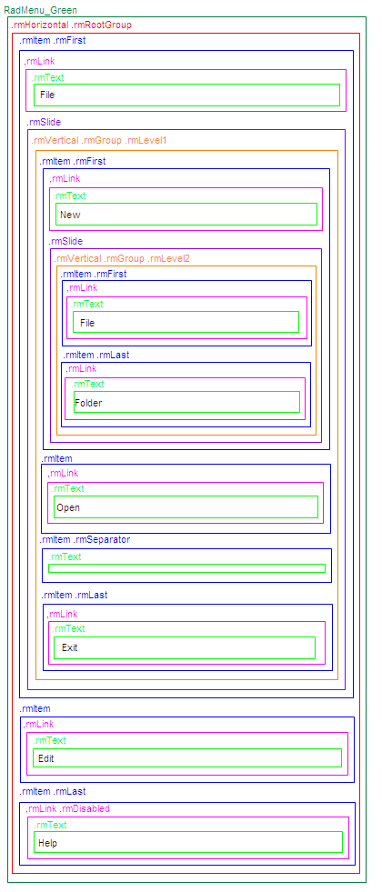

# Understanding the Skin CSS File


Styles for RadControls are defined using Cascading Style Sheet (CSS) syntax. Each style consists of a selector that identifies an HTML element to be styled, and property/value pairs that describe each of the style specifics, e.g. color, padding, margins, etc. For example, the ".rmGroup" style will have a solid green border and white background:

````ASPNET
.RadMenu_Green .rmGroup { border: 1px solid green; background-color: #fff;}
````


See the [CSS Skin FileSelectors]() topic for more information on the specific CSS selectors used for **RadMenu** skins. You can see custom styles applied in the screenshot below:



Each style maps to a "class" attribute in an HTML tag. For example, consider the HTML rendering of the menu shown above:

````HTML
<div id="Div1" class="RadMenu RadMenu_Green ">
 <ul class="rmHorizontal rmRootGroup">
   <li class="rmItem rmFirst">
     <a href="#" class="rmLink ">
       <span class="rmText">File</span>
     </a>
     <div class="rmSlide">
       <ul class="rmVertical rmGroup rmLevel1">
         <li class="rmItem rmFirst">
           <a href="#" class="rmLink ">
             <span class="rmText">New...</span>
           </a>
           <div class="rmSlide">
             <ul class="rmVertical rmGroup rmLevel2">
               <li class="rmItem rmFirst">
                 <a href="#" class="rmLink ">
                    <span class="rmText">File</span>
                 </a>
               </li>
               <li class="rmItem rmLast">
                 <a href="#" class="rmLink ">
                   <span class="rmText">Folder</span>
                 </a>
               </li>
             </ul>
           </div>
         </li>
         <li class="rmItem">
           <a href="#" class="rmLink ">
             <span class="rmText">Open</span>
           </a>
         </li>
         <li class="rmItem rmSeparator ">
           <span class="rmText"></span>
         </li>
         <li class="rmItem rmLast">
           <a href="#" class="rmLink ">
             <span class="rmText">Exit</span>
           </a>
         </li>
       </ul>
     </div>
   </li>
   <li class="rmItem">
     <a href="#" class="rmLink ">
       <span class="rmText">Edit</span>
     </a>
   </li>
   <li class="rmItem rmLast">
     <a href="#" class="rmLink rmDisabled ">
       <span class="rmText">Help</span>
     </a>
   </li>
 </ul>
 <input id="RadMenu1_ClientState" name="RadMenu1_ClientState" type="hidden" />
</div> 
````


The control is rendered as a DIV element with the class "**RadMenu RadMenu_Green**". The item hierarchy is presented as nested unordered lists with links inside, all containing nested class attributes.

Here is a more detailed breakdown of the rendered markup:

## Root tag

The menu is rendered as a **DIV** tag. Here is an excerpt from the example above:

````HTML
<div id="RadMenu1" class="RadMenu RadMenu_Green ">
    <!-- menu content goes here -->
</div>
````

The **ID** attribute of the DIV tag is set to the **ClientID** property of the **RadMenu** control. As you can see two CSS classes have been applied: "**RadMenu**" and "**RadMenu_Green**". The "**RadMenu**" class is always applied. It defines the basic presentation of the menu which is common for all skins. The "**RadMenu_Green**" class is applied because the **Skin** of the menu is set to **"Green"**. If the the menu does not use a skin (the **Skin** property is set to **""**) only the "**RadMenu**" CSS class would be rendered.

If you set the **Style** or **CssClass** property of the RadMenu control they would be applied to the root menu tag:

````HTML
<telerik:RadMenu runat="server" ID="RadMenu1" Skin="Green" CssClass="MyMenu" Style="position: relative; z-index: 1000">
````

## Root item group

The root item group renders as a **UL** (unordered list)tag:

````HTML
<ul class="rmHorizontal rmRootGroup">
    <!-- root elements and their children go here -->
</ul>
````


It has two CSS classes applied: "**rmHorizontal**" and "**rmRootGroup**". The "**rmHorizontal**" class is applied because the **Flow** of the **RadMenu** is horizontal by default. If it were vertical that CSS class would be "**rmVertical**". The "**rmRootGroup**" CSS class is always rendered.

## Menu items

RadMenuItem renders as a **LI** (list item) tag, containing an **A**(link or anchor) tag. The text of the item is rendered inside a **SPAN** tag:

````HTML
<li class="rmItem">
    <a href="#" class="rmLink ">
        <span class="rmText">Edit</span> 
    </a>
    <!-- child items go here -->
</li>
````

The **LI** tag has its **class** attribute always set to "**rmItem**". The **A** tag has its class attribute always set to "**rmLink**". The **SPAN** tag has its class attribute always set to "**rmText**". If the **Style** or **CssClass** properties of the **RadMenuItem** class are set they are applied to the **A** tag.

If the item is the first child of its parent, the **LI** tag also has the "**rmFirst**" CSS class applied:

````HTML
<li class="rmItem rmFirst">
    <a href="#" class="rmLink ">
        <span class="rmText">File</span>
    </a>
    <!-- child items go here -->
</li>
````

If the item is the last child of its parent, the **LI** tag has the "**rmLast**" CSS class applied:

````HTML
<li class="rmItem rmLast">
    <a href="#" class="rmLink rmDisabled ">
        <span class="rmText">Help</span> 
    </a>
</li>
````


Note that in this example, the item is disabled, so the **A** tag has the "**rmDisabled**" class applied as well as the "**rmLink**" class.

>note If an item is the only child of its parent it has both the " **rmFirst** " and " **rmLast** " CSS classes.
>


If the item is a separator (its **IsSeparator** property is **True**), the **LI**tag gets the "**rmSeparator**" class applied. Because separators do not respond to user clicks, it has no **A**element:

````HTML
<li class="rmItem rmSeparator ">
    <span class="rmText"></span>
</li>
````


## Item States

The **Last Menu Item** example showed a disabled item with the "**rmDisabled**" class applied to the **A** tag. Other item states also result in additional CSS classes applied to the **A** tag:

* **Focused items**: An item is focused when clicked or when it is selected with the keyboard (by using the TAB key or a shortcut - access key). When an item is focused one additional CSS class - "**rmFocused**" is applied to the **A** tag.

* **Expanded items**: An item is expanded when the user hovers it with the mouse. When an item is expanded one additional CSS class - "**rmExpanded**" is applied to the **A** tag.

* **Clicked items**: An item is clicked when the user clicks it with the mouse and keeps the mouse button pressed. When an item is in clicked state one additional CSS class - "**rmClicked**" is applied to the **A** tag. When the user releases the mouse button, the "**rmClicked**" CSS class is removed. This CSS class is useful to visually show that a menu item is clicked.

## Child item groups

If the item has children they are rendered in an **UL** tag within the **LI** tag of their parent item:

````HTML
<div class="rmSlide">
    <ul class="rmVertical rmGroup rmLevel1">
        <!-- child items go here -->
    </ul>
</div>
````

>note The DIV tag whose class attribute is set to "rmSlide" is used by the animation effects. It is not related with the final appearance and can be ignored.
>


The child item group has three CSS classes applied: "**rmVertical**", "**rmGroup**" and "**rmLevel1**". The "**rmVertical**" class is applied because the default item flow for child items is vertical. If it were horizontal (GroupSettings-Flow="Horizontal") that class would have been "**rmHorizontal**". The "**grGroup**" class is always applied for child item groups. The "**rmLevel1**" class is applied for all level 1 item groups. Root items are considered as level 0, their children are level 1, their children's children are level 2 and so on.

## Graphic representation of CSS Classes in the HTML output

The following diagram shows a symbolic view of the CSS classes in the rendered menu:



# See Also

 * [Appearance Skins]()

 * [Setting  the CSS Class of Items]()
