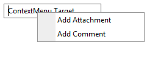

# Creating Context Menu at Runtime

## 

The example below shows how to dynamically create ContextMenu and apply it to a control on the page. The code below creates a ContextMenuand attaches it to a RadTextBox control.



````ASP.NET
 <telerik:RadTextBox RenderMode="Lightweight" ID="RadTextBox1" runat="server" Text="ContextMenu Target">
 </telerik:RadTextBox>
````


````C#
RadContextMenu rcm = new RadContextMenu();
rcm.ID = "contextMenu1";

RadMenuItem rmi = new RadMenuItem();
rmi.Text = "Add Attachment";
rmi.Value = "1";
rcm.Items.Add(rmi);

RadMenuItem rmi1 = new RadMenuItem();
rmi1.Text = "Add Comment";
rmi1.Value = "2";
rcm.Items.Add(rmi1);

ContextMenuControlTarget editZone = new Telerik.Web.UI.ContextMenuControlTarget();
editZone.ControlID = "RadTextBox1";
rcm.Targets.Add(editZone);
form1.Controls.Add(rcm);
form1.Controls.Add(RadTextBox1);
````
````VB.NET
Dim rcm As New RadContextMenu()
rcm.ID = "contextMenu1"

Dim rmi As New RadMenuItem()
rmi.Text = "Add Attachment"
rmi.Value = "1"
rcm.Items.Add(rmi)

Dim rmi1 As New RadMenuItem()
rmi1.Text = "Add Comment"
rmi1.Value = "2"
rcm.Items.Add(rmi1)

Dim editZone As ContextMenuControlTarget = New Telerik.Web.UI.ContextMenuControlTarget()
editZone.ControlID = "RadTextBox1"
rcm.Targets.Add(editZone)
form1.Controls.Add(rcm)
form1.Controls.Add(RadTextBox1)
````

