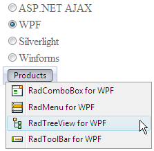

# WCF Web Service Binding

## 

As of Q1 2009, RadMenu supports load on demand from **WCF service**.

The steps below show how to load the items of RadMenu from WCF service. It shows how to use the **context** object to pass information from the client to the OperationContract. We will set additional **Attributes** for every item (in addition to the **Text** and **Value** properties) so we can see how to use them in the [OnClientItemPopulated]() event.

1. Create a new Web Site in Visual Studio 2008. Make sure the target framework is set to 3.5

2. Drag RadMenu from your toolbox. From the SmartTag click on the Add RadScriptManager link. It will automatically register the handler in the web.config file


3. Add the WCF service – right click on your project in the Solution Explorer and select Add New Item.

This is **important**: select the **Ajax-enabled WCF service** option (do not mix it with WCF Service):


Clicking the Add button will create the .svc file as well as the code behind file placed in the App_Code folder. The web.config file is also automatically updated with the appropriate system.serviceModel node:

````XML
<system.servicemodel>
  <behaviors>
	<endpointBehaviors>
	  <behavior name="ServiceAspNetAjaxBehavior">
		<enableWebScript />
	  </behavior>
	</endpointBehaviors>
  </behaviors>
  <serviceHostingEnvironment aspNetCompatibilityEnabled="true" />
  <services>
	<service name="Service">
	  <endpoint address="" behaviorConfiguration="ServiceAspNetAjaxBehavior" binding="webHttpBinding" contract="Service" />
	</service>
  </services>
</system.servicemodel>
````

>caution These settings are **important** . If you don't have them correct - you might receive a javascript error:
> **Method "MethodName" Failed.** 
>


4. Open the Service.cs file and add the method which will return the menu items.

````C#
[ServiceContract(Namespace = "")]
[AspNetCompatibilityRequirements(RequirementsMode = AspNetCompatibilityRequirementsMode.Allowed)]
public class Service
{
	[OperationContract]
	public RadMenuItemData[] GetData(RadMenuItemData item, IDictionary<string, object> context)
	{
		List<RadMenuItemData> items = new List<RadMenuItemData>();
		//use the context to get the selected radio button
		string productsSuite = context["ProductSuite"].ToString();
		//the datasource
		List<String> radControls = new List<string>()
							  {
								  "RadMenu",
								  "RadMenu",
								  "RadTreeView",
								  "RadToolBar"
							  };
		foreach (string radControl in radControls)
		{
			RadMenuItemData newItem = new RadMenuItemData()
			{
				Text = string.Format("{0} for {1}", radControl, productsSuite),
				Value = radControl,
				ImageUrl = "Images/" + radControl + ".gif",
				//Optional: set the attribute of the item which will be used
				//in the OnClientNodePopulated event
				Attributes = new Dictionary<string, object> { { "MyCustomAttribute", radControl } }
			};
			items.Add(newItem);
		}
		return items.ToArray();
	}
} 
````

Note that the above code uses the context object which passes the information of the selected RadioButton on the page and is set in the [OnClientItemPopulating]() event.

You can set additional attributes to every item by using the Attributes dictionary. Later, you can read these attributes in [OnClientItemPopulated]() event.

````JavaScript
function OnClientItemPopulatingHandler(sender, e) 
{        
	var context = e.get_context();
	//using jQuery to get the checked item and pass it to the server        
	context["ProductSuite"] = $telerik.$("input[name='rblSuites']:checked").val();
}       
 
function OnClientItemPopulatedHandler(sender, e)
{        
	var items = e.get_item().get_items();
	for (var i = 0; i < items.get_count(); i++)
	{           
		var item = items.getItem(i);
		//getting the attribute of the item  
		var myCustomAttribute = item.get_attributes().getAttribute("MyCustomAttribute");
		//do something with the attribute
	}    
}
````

Here is the menu declaration:

````ASP.NET
<asp:RadioButtonList ID="rblSuites" runat="server">
	<asp:ListItem Selected="True">ASP.NET AJAX</asp:ListItem>
	<asp:ListItem>WPF</asp:ListItem>
	<asp:ListItem>Silverlight</asp:ListItem>
	<asp:ListItem>Winforms</asp:ListItem>
</asp:RadioButtonList>
<telerik:RadMenu RenderMode="Lightweight" ID="RadMenu1" OnClientItemPopulating="OnClientItemPopulatingHandler"
	OnClientItemPopulated="OnClientItemPopulatedHandler" runat="server">
	<Items>
		<telerik:RadMenuItem Text="Products" ExpandMode="WebService">
		</telerik:RadMenuItem>
	</Items>
	<WebServiceSettings Method="GetData" Path="Service.svc" />
</telerik:RadMenu>
````

and the result:



# See Also

 * [Online Demo](http://demos.telerik.com/aspnet-ajax/menu/examples/loadondemand/wcf/defaultcs.aspx)

 * [Web Service Binding]()
