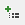

# RadMenu Item Builder

The **RadMenu Item Builder** lets you populate your menu with a hierarchy of items that do not come from a separate data source. There are two ways to bring up the RadMenu Item Builder:

* From the **RadMenu** [Smart Tag](), click on the **Build RadMenu** link.

* Right-click on the **RadMenu** component and select **Build RadMenu** from its context menu.

## RadMenu Item Builder

The **RadMenu Item builder** lets you add, rearrange, configure, and delete menu items. These actions are initiated using the tool bar at the upper left of the Item builder:

The following table describes the controls in the tool bar:

>caption  

| Button | Function |
| ------ | ------ |
||Adds a root item to the menu in the next available position. Root items are the top-level items (menu items with no parent item).|
||Adds a child item to the currently selected menu item. The child can belong to either a root item or another child item.|
||Deletes the currently selected menu item. When you delete a menu item, its child items are deleted as well.|
||Moves the currently selected menu item up a level, making it a sibling to its parent item (following the parent item).|
||Moves the currently selected menu item down a level, making it the child of its previous sibling.|
||Moves the currently selected menu item backward in its current list of siblings, so that it precedes the previous sibling.|
||Moves the currently selected menu item forward in its current list of siblings, so that it follows the next sibling.|

When a menu item (either a root item or a child item) is selected, the properties pane on the right of the **RadMenu Item Builder** lets you configure the item by setting its properties. For each item,

* **Text** is the text of the item as it appears in the menu.

* **ToolTip** is the text of a tooltip that appears when the user hovers the mouse over the item.

* **Enabled** controls whether the item is initially enabled or disabled.

* **GroupSettings** lets you [specify how the child items are laid out]().

* **IsSeparator** specifies whether the menu item acts as a separator.

* **Value** lets you associate a text value with the menu item that you can use when programming the menu behavior.

* **NavigateUrl** and **Target** cause the menu item to automatically launch another Web page (specified by **NavigateUrl**) in the window specified by **Target**. If the **Target** property is not set, the new Web page uses the current browser window.

* **PostBack** specifies whether the item causes a postback.

* **CssClass**, **ClickedCssClass**, **DisabledCssClass**, **ExpandedCssClas**, and **FocusedCssClass**[control the appearance of the menu item]() when it is in its normal state, clicked, disabled, expanded, and holds input focus, respectively.

* **ImageUrl**, **ImageClickedUrl**, **DisabledImageUrl**, **ExpandedImageUrl**, and **HoveredImageUrl** let you [specify an image]() that appears on the left of the menu item when it is in its normal state, clicked, disabled, expanded, and when the mouse hovers over it, respectively.

# See Also

 * [Overview]()
