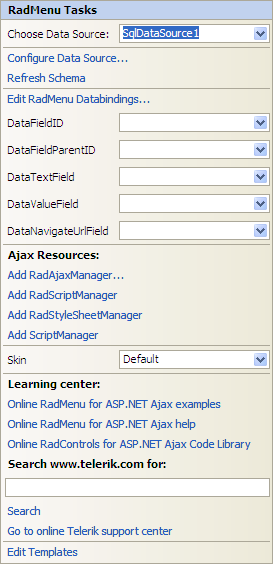

# Smart Tag

The **RadMenu** Smart Tag allows easy access to frequently needed tasks. You can display the Smart Tag by right clicking on a **RadMenu** control in the design window, and choosing **Show Smart Tag**.

## Unbound Smart Tag

When **RadMenu** is unbound, the Smart Tag looks like the following:

Using the unbound **RadMenu** Smart Tag you can perform the following:

## RadMenu Tasks

* **Choose Data Source** lets you bind the menu declaratively by selecting a data source from a drop-down list of all available data source components. If you select **<New Data Source...>** the standard Windows [Data Source Configuration Wizard](http://msdn2.microsoft.com/en-us/library/ms247282(VS.80).aspx) appears, where you can create and configure a data source component.

* **Build RadMenu...** opens the [RadMenu Item Builder](), where you can create and configure statically-defined items for your menu.

## Ajax Resources

* **Add RadAjaxManager...** adds a RadAjaxManager component to your Web page, and displays the **RadAjaxManager Property Builder** where you can configure it.

* **Replace ScriptManager with RadScriptManager** replaces the default **ScriptManager** component that is added for AJAX-enabled Web sites with **RadScriptManager**.

* Add **RadStyleSheetManager** adds a **RadStyleSheetManager** to your Web page.

## Skin

The **Skin** drop-down lets you preview the built-in [skins]() and select one for your menu.

## Learning Center

Links navigate you directly to RadMenu examples, help, or code library. You can also search the Telerik web site for a given string.

## Edit Templates

Clicking the **Edit Templates** link brings up a [template design surface]() where you can create or edit the [templates]() your **RadMenu** uses.

## Bound Smart Tag

When **RadMenu** is bound to a data source, the Smart Tag looks like the following:

>caption 

Using the bound **RadMenu** Smart Tag you can perform the following:

## RadMenu Tasks

* **Choose Data Source** lets you change the declarative menu binding by selecting a data source from a drop-down list of all available data source components. If you select "**<New Data Source...>**" the standard Windows [Data Source Configuration Wizard](http://msdn2.microsoft.com/en-us/library/ms247282(VS.80).aspx) appears, where you can create and configure a data source component. If you select "**(None)**", you remove the existing binding.

* **Configure Data Source...** opens the standard Windows [Data Source Configuration Wizard](http://msdn2.microsoft.com/en-us/library/ms247282(VS.80).aspx), where you can configure the currently bound data source component.

* **Refresh Schema**refreshes the schema for the currently bound data source component.

* **Edit RadMenu Databindings**... opens the [NavigationItemBinding Collection Editor](), where you can specify [databindings]() to map between the fields in the data source and **RadMenuItem**properties.

* Once the Data Source is chosen, you can select each one of the following: **DataFieldID**,**DataFieldParentID**,**DataTextField**,**DataValueField** and **DataNavigationUrlField**. For the first two, you need to select the fields in the Data Source that will be used when creating the hierarchy of the RadMenu. The rest will serve data respectively for the **Text,****Value** and **NavigateUrl** properties of RadMenu Items.

* **Edit Templates** brings up the [template design surface](), where you can create or edit the [templates]() your **RadMenu** uses.
