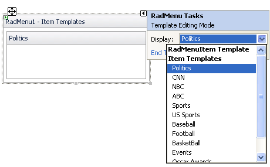

# Template Design Surface

## 

The __Template Design Surface__ lets you design templates for the items that appear in the menu. There are two ways to display the Template Design Surface:

* Choose __Edit Templates__ from the RadMenu [Smart Tag]():

* Choose __Edit Template__ from the RadMenu context menu and select the type of template you want to edit:

Either way, The Template Design Surface appears:

On the design surface, you can drag any controls from the toolbox, as well as typing any literal text. By moving to Source view, you can add other HTML content to the template and set attributes to display the item's value.

You can edit templates for all items using the __RadMenuItem Template__. You can also edit templates for individual menu items. Once you have added menu items to your __RadMenu__ component, select a specific item from the list of item templates in the Smart Tag, or edit them all at once by choosing __Edit Template | Item Templates__ from the RadMenu context menu.

When you have finished designing your template, choose __End Template Editing__ from the __RadMenu__ context menu or Smart Tag.

# See Also

 * [Overview]()
