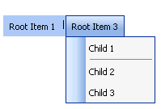

# Separators

## 

The menu layout can be customized through separators. Use separators for grouping items into two or more categories. You can also use them to achieve cosmetic effects.

To set a given menu item as a separator, set its **IsSeparator** property to **True**. You can then define its size using the **Width** property. The **Text** property value will still be rendered, but the item will not respond when the user clicks it.

The example below shows menu with two separator items: one on the horizontally flowing root items, and one on the vertically flowing child items:



````ASPNET
<telerik:RadMenu ID="RadMenu1" runat="server" Flow="Horizontal" Skin="Outlook">
    <Items>
        <telerik:RadMenuItem runat="server" Text="Root Item 1">
            <Items>
                <telerik:RadMenuItem runat="server" Text="Child Item 1" />
                <telerik:RadMenuItem runat="server" Text="Child Item 2" />
            </Items>
        </telerik:RadMenuItem>
        <telerik:RadMenuItem runat="server" IsSeparator="True" Text="|" />
        <telerik:RadMenuItem runat="server" Text="Root Item 3">
            <Items>
                <telerik:RadMenuItem runat="server" Text="Child 1" />
                <telerik:RadMenuItem runat="server" IsSeparator="True" />
                <telerik:RadMenuItem runat="server" Text="Child 2" />
                <telerik:RadMenuItem runat="server" Text="Child 3" />
            </Items>
        </telerik:RadMenuItem>
    </Items>
</telerik:RadMenu>
````

# See Also

 * [Layout of Root Items ]()
