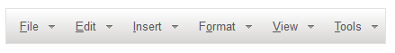

# Toggle Handle

## Toggle Handle

As of **Q3 2013** the **RadMenu** features a new functionality aiming to improve its usability and user experience under mobile devices. This new functionality is enabled through the **ShowToggleHandle** property of the control, which is **false** by default.Once enabled (by setting the aforementioned property to **True**) a **Toggle Handle** will appear beside the text or image of the the **RadMenuItem**. Once clicked or touched the **Toggle Handle** will show or hide the child items of the corresponding item to which it belongs. It is also worth mentioning that this **Toggle Handle** will be shown only when the menu item has children or when its **ExpandMode** is set to **WebService**.
>caption Figure1

Due to the nature of the **RadMenu** and its current implementation, there were few challenges that we needed to overcome when designing a unified behavior for both a traditional desktop environment and a touch enabled one. By default, the child menu items are shown once their parent item is hovered. While such scenario is applicable in traditional mouse centric environments, it introduces problems on touch-enabled devices when the parent items have the **NavitageUrl** set or have to execute some action like server-side event upon click or touch.

However, when you enable the **Toggle Handle**, these problems are solved.For example once you click or touch the **Toggle Handle**, it will only show or hide the children of the particular item without executing any action (navigation or sever event execution).

The event order when the **Toggle Handle** is clicked or touched is the same as the one when the menu item is hovered. First the **OnClientItemOpening** is fired followed by **OnClientItemOpened** when the menu item is closed or **OnClientItemClosing** followed by **OnClientItemClosed** when the menu item is opened.

# See Also

 * [Online demo](https://demos.telerik.com/aspnet-ajax-beta/menu/examples/functionality/togglehandle/defaultcs.aspx)
