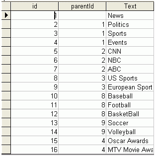

# Binding to a Data Source

## 

This tutorial will show how to bind **RadMenu** to an **AccessDataSource**:

1. Drag a **RadMenu** component from the toolbox onto your Web page. The **RadMenu**[Smart Tag]() should appear automatically:

1. In the **RadMenu** Smart Tag, use the **Skin** drop-down to change the [skin]() for the **RadMenu** to "Outlook":

1. Still in the Smart Tag, open the **Choose Data Source** drop-down and select **New Data Source**.

1. The Data Source Configuration Wizard appears. In the Select a DataSource Type screen, specify an **AccessDataSource** and click **OK.**

1. In the **Choose a Database** screen, click the **Browse** button, and select a data file. Then choose **Next** to continue:

1. In the **Configure the Select Statement** screen, choose **Specify columns from a table or view**, and select the columns for the RadMenuItem **ID**, parent RadMenuItem **ID**, and RadMenuItem **Text** properties. Then choose **Next** to continue:

1. The data should have a structure something like the following:

1. Click the **Finish** button to exit the Wizard.

1. In the Properties pane for the **RadMenu** component, set the **DataFieldId**, **DataFieldParentId** and **DataTextField** properties by selecting the appropriate fields from the drop-down list:

1. Run the application. The final result should look like the following:

# See Also

 * [Overview]()

 * [Overview]()

 * [Creating a Simple Context Menu]()
