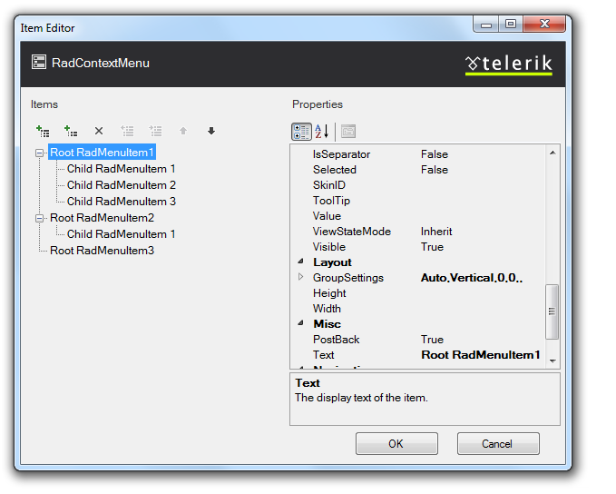

# Creating a Simple Context Menu

## 

This tutorial will walk you through creating a simple __RadContextMenu__ and shows how to:

* Use the __RadMenu Item Editor__ to build a simple context menu.

* Use the Targets collection to attach the context menu to another control.

1. Drag a __RadContextMenu__ component from the toolbox onto your Web page. The __RadContextMenu__[Smart Tag]() should appear automatically:

1. On the Smart Tag, choose __Edit Items.__ The [RadMenu Item Builder]() appears:

1. Click the __Add root item__ button () to add a root item to your menu.

1. With the root item selected, click the __Add child item__ button () to add a child to your root item.

1. Add some more root items, and child items using the __Add root item__ button and the __Add child item__ button:

1. Select one of the child items, and change its __IsSeparator__ property to __True__ and its __Text__ property to an empty string (""):

1. Click __OK__ to confirm and exit.

1. Right click on the __RadContextMenu__, and from its context menu, choose __Properties__.

1. From the Standard area of the toolbox, drag a __Label__ onto your page. Set its __Text__ property to "Label1".

1. Move to the Source view of your Web page and locate the declaration of your __RadContextMenu__.

1. Select __Edit Targets__ from the smart tag.

1. From the __Target Editor__ select to __Add Control Target__. This attaches your context menu to a specific control, based on its ID:

1. Select the ControlID attribute from the dropdown that appears:

1. Select __Ok__ and run the application. Right-click on the label and see your context menu appear:

# See Also

 * [RadContextMenu Object]()
