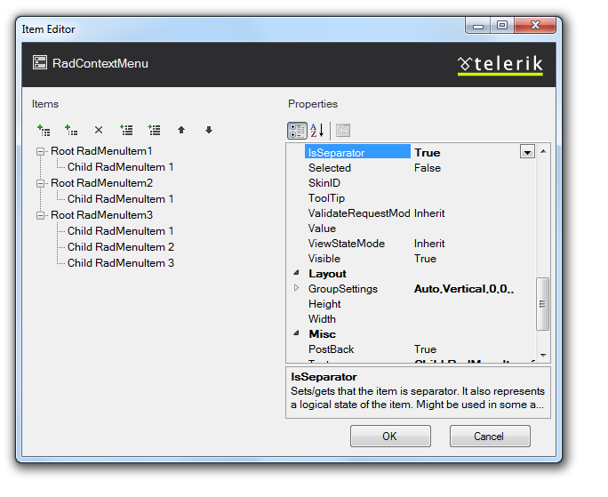

# Creating a Simple Context Menu

## 

This tutorial will walk you through creating a simple **RadContextMenu** and shows how to:

* Use the **RadMenu Item Editor** to build a simple context menu.

* Use the Targets collection to attach the context menu to another control.

1. Drag a **RadContextMenu** component from the toolbox onto your Web page. The **RadContextMenu** [Smart Tag]() should appear automatically: 

1. On the Smart Tag, choose **Edit Items.** The [RadMenu Item Builder]() appears:

1. Click the **Add root item** button () to add a root item to your menu.

1. With the root item selected, click the **Add child item** button () to add a child to your root item.

1. Add some more root items, and child items using the **Add root item** button and the **Add child item** button:

1. Select one of the child items, and change its **IsSeparator** property to **True** and its **Text** property to an empty string (""):

1. Click **OK** to confirm and exit.

1. Right click on the **RadContextMenu**, and from its context menu, choose **Properties**.

1. From the Standard area of the toolbox, drag a **Label** onto your page. Set its **Text** property to "Label1".

1. Move to the Source view of your Web page and locate the declaration of your **RadContextMenu**.

1. Select **Edit Targets** from the smart tag.

1. From the **Target Editor** select to **Add Control Target**. This attaches your context menu to a specific control, based on its ID:

1. Select the ControlID attribute from the dropdown that appears:

1. Select **Ok** and run the application. Right-click on the label and see your context menu appear:

# See Also

 * [RadContextMenu Object]()
