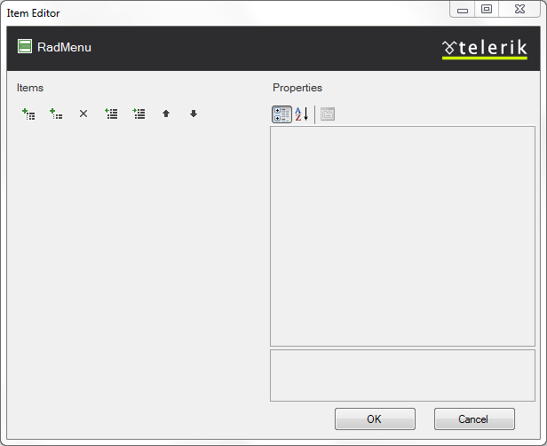
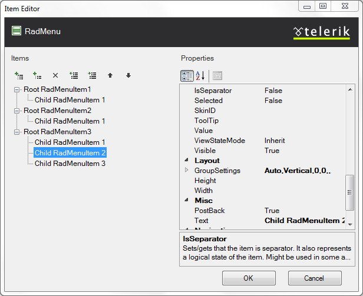
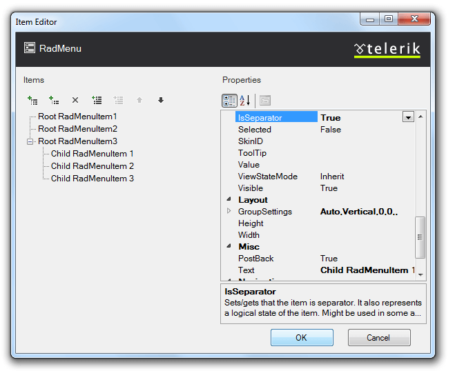
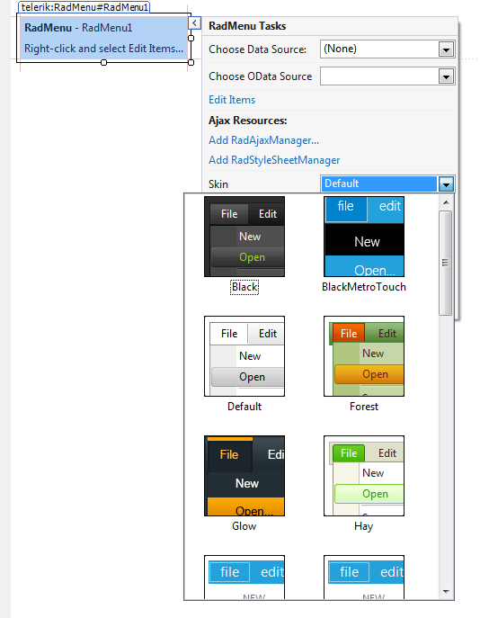
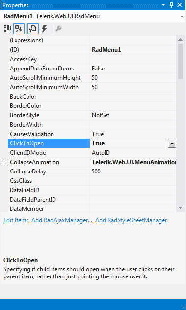
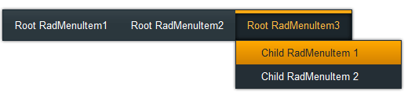

# Getting Started Overview

This tutorial will walk you through creating a **RadMenu** and shows how to:

* Use the **RadMenu Item Editor** to build a simple menu.

* Apply a skin to the menu to change its look & feel.

* Set **RadMenu** properties.

## Creating a menu using the RadMenu Item Builder

1. Drag a **RadMenu** component from the toolbox onto your Web page. The **RadMenu**[Smart Tag]() should appear automatically:

1. On the Smart Tag, choose **Edit Items.** The [RadMenu Item Builder]() appears:

1. Click the **Add root item** button () to add a root item to your menu.

1. With the root item selected, click the **Add child item** button () to add a child to your root item.

1. Add some more root items, and child items using the **Add root item** button and the **Add child item** button:

1. Select one of the child items, and change its **IsSeparator** property to **True** and its **Text** property to an empty string (""):

1. Click **OK** to confirm and exit.

1. Back in the **RadMenu** Smart Tag, use the **Skin** drop-down to change the [skin]() for the **RadMenu** to "Outlook":

1. The appearance of the RadMenu in the designer changes to reflect the new skin:

1. Right click on the **RadMenu**, and from its context menu, choose **Properties**.

1. In the properties pane, set the **ClickToOpen** property to **True**. This causes the menu to [display its child items when clicked]():

1. Run the application. Click on the menu items to display the child items:

# See Also

 * [Binding to a Data Source]()

 * [Creating a Simple Context Menu]()
