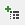
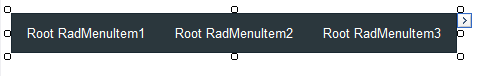

# Getting Started Overview

This tutorial will walk you through creating a __RadMenu__ and shows how to:

* Use the __RadMenu Item Editor__ to build a simple menu.

* Apply a skin to the menu to change its look & feel.

* Set __RadMenu__ properties.

## Creating a menu using the RadMenu Item Builder

1. Drag a __RadMenu__ component from the toolbox onto your Web page. The __RadMenu__[Smart Tag]() should appear automatically:

1. On the Smart Tag, choose __Edit Items.__ The [RadMenu Item Builder]() appears:

1. Click the __Add root item__ button () to add a root item to your menu.

1. With the root item selected, click the __Add child item__ button () to add a child to your root item.

1. Add some more root items, and child items using the __Add root item__ button and the __Add child item__ button:

1. Select one of the child items, and change its __IsSeparator__ property to __True__ and its __Text__ property to an empty string (""):

1. Click __OK__ to confirm and exit.

1. Back in the __RadMenu__ Smart Tag, use the __Skin__ drop-down to change the [skin]() for the __RadMenu__ to "Outlook":

1. The appearance of the RadMenu in the designer changes to reflect the new skin:

1. Right click on the __RadMenu__, and from its context menu, choose __Properties__.

1. In the properties pane, set the __ClickToOpen__ property to __True__. This causes the menu to [display its child items when clicked]():

1. Run the application. Click on the menu items to display the child items:

# See Also

 * [Binding to a Data Source]()

 * [Creating a Simple Context Menu]()
