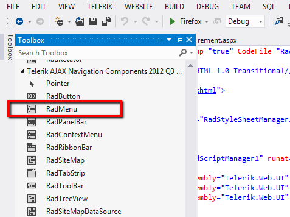
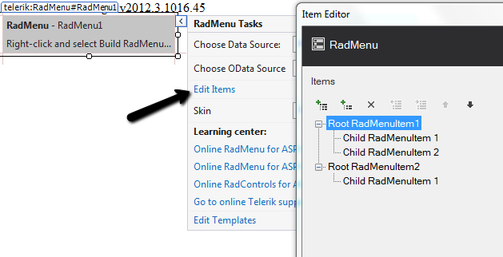
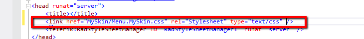
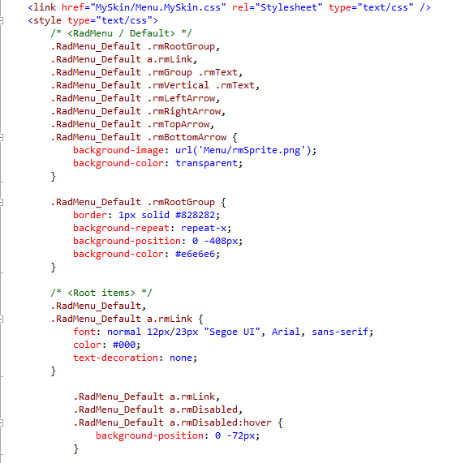
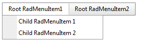
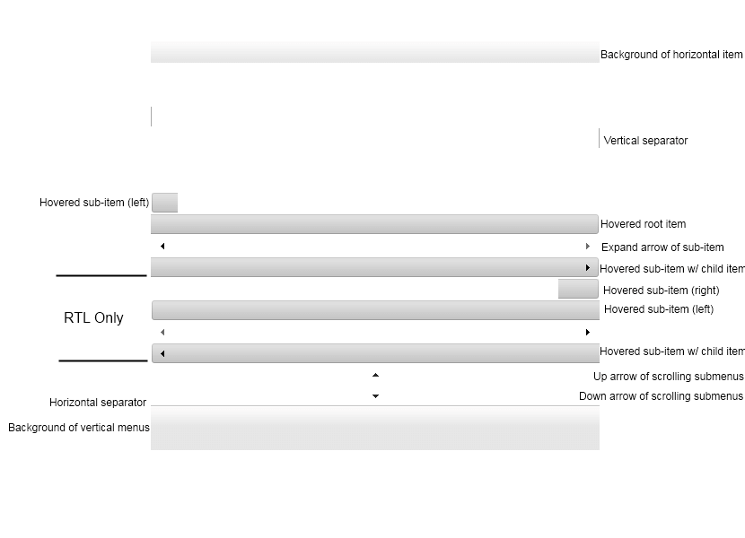

# How to Change Height of RadMenu


The following tutorial demonstrates how you can alter the **height** of the **RadMenu** while preserving all of the hover effects that are applied.

**Q:** I want to increase the height of the RadMenu. For example I need the root Items and the child Items to be 5px higher than their original state.How can I do that?

**A:** One way would be to use our [Visual Style Builder](http://www.telerik.com/products/aspnet-ajax/visual-style-builder.aspx) to create your customized skin. However, the limitations of this approach are that the nicely shaped rounded corners of the RadMenu control will be lost as well as the different effects that are usually applied when using a sprite image. The second approach is when using some of the predefined Telerik skins. Since our skins are based on sprite images, in order to change the height one will need to change the whole sprite image of the control. Below is a full explanation of how this could be achieved and what the various elements of the RadMenu sprite are used for.

## Prepare the Project

1. Create a new Web site using Visual Studio.

1. Drag and drop a RadMenu control.

1. Add RadScriptManager.

1. Build RadMenu control.

## Prepare the External Skin and Image Folder

1. Create a new folder called *MySkin*

1. Copy the *Menu* folder that contains the sprite images of the RadMenu control and paste it to the *Myskin* folder.

1. Copy the *Menu.Default.css* style sheet file and place it in the *MySkin* folder.

>note With the default installation of the ASP.NET AJAX control the file path will typically be similar to this example: \Program Files\Telerik\<Your Version of RadControls for ASPNET>\Skins\ Default.
>


1. Change the name of the file *Menu.Default.css* file to *Menu.MySkin.css*.

1. Drag and drop the *Menu.MySkin.css*file from the Solution Explorer onto your Web page.

1. Set the **EnableEmbeddedSkins** property of the RadMenu control to *False*.

1. Change the **Skin** property of your RadMenu control to *"MySkin"*.

1. Open the *Menu.Default.css* and replace all of the *RadMenu_ Default* instances with *RadMenu_MySkin* and save the file.

1. Run the application. The new *"MySkin"* skin looks just like the *Default* skin:

## Getting Straight to the Point - Alter the Sprite Image so that we can Change the Height of the RadMenu Control

Now that we have an external skin of our own, we can start changing it to fit our needs. However, if you are not very experienced with Photoshop it might take a little longer than expected since you will need to alter many of the elements of the sprite image. To make things a bit clearer here is a descriptive sprite image that is used for the RadMenu control. In general all of the sprites for the RadMenu follow a very similar pattern therefore no matter which sprite image we will take the states will be very similar if not identical to the image below.



## Using Css Class Selectors

Now that we are done with the sprite images, a relatively easy part remains – fixing the skin CSS to support the new sprite height we have made. First thing you need to do is simply get the modified image and overwrite the current one that is located in the MySkin\Menu folder. Then switch to your editor and open the CSS file. Now we need to adjust the default height (that is 25px) of the RadMenu items. Add the following CSS rules somewhere in your CSS file, let’s say at the end:

````ASPNET
	      /*changes line height for the root menu items*/
			.RadMenu_MySkin .rmHorizontal .rmRootLink span.rmText{
	  			  height: 30px;
			}
		/*changes height for the child menu items */
			.RadMenu .rmVertical .rmText,
			.RadMenu .rmHorizontal .rmVertical .rmText {
	      			 height: 30px;
			}
	
````


# See Also

 * [CSS Image Sprites](http://www.w3schools.com/css/css_image_sprites.asp)

 * [Appearance Skins]()

 * [Setting  the CSS Class of Items]()
