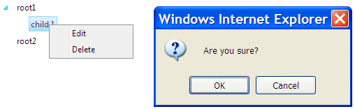

# How to Disable the Collapse Animation at Client-side


## 

This article describes how to hide the RadContextMenu and get a confirmation dialog when a user clicks on an item from the menu. In general you will notice that the context menu is not hidden until you close the confirmation dialog. Even if you call the **hide()** method before showing the confirm dialog - the context menu is not hidden because the collapse animation needs some time to execute and the confirm method blocks its execution. You end up with a similar screen:




To prevent this behavior you can disable the collapse animation of the context menu before we hide it. This way it will hide immediately. After that we can enable it again. To achieve that you need to subscribe to the [OnClientContextMenuItemClicking](B154D1F1-C612-4E34-9FD6-4193F8AB5697) (in case of a treeview's context menu) **or** [OnClientItemClicking]() event and define the event handlers as follows:

````JavaScript
function OnClientContextMenuItemClicking(sender, e) {
    var item = e.get_menuItem();
    var menu = item.get_menu();
    var oldType = menu._slide._collapseAnimation.get_type();
    menu._slide._collapseAnimation.set_type(Telerik.Web.UI.AnimationType.None);
    menu.hide(); menu._slide._collapseAnimation.set_type(oldType);
    if (!confirm("Are you sure?"))
        e.set_cancel(true);
} 	
````

````JavaScript
function OnClientItemClicking(menu, e) {
    var item = e.get_item();
    var parent = item.get_parent();
    if (parent == menu) 
        return;
    var oldType = parent._slide._collapseAnimation.get_type();
    parent._slide._collapseAnimation.set_type(Telerik.Web.UI.AnimationType.None);
    menu.close();
    parent._slide._collapseAnimation.set_type(oldType);
    if (!confirm("Are you sure?"))
        e.set_cancel(true);
}		
````


