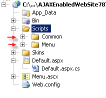

# Use RadMenu in a User Control with OutputCache Enabled

## 

Suppose you need to cache a user control which has a RadMenu control in it.

````ASP.NET
<%@ control language="C#" autoeventwireup="true" codefile="Menu.ascx.cs" inherits="Menu" %>
<%@ outputcache duration="10" varybyparam="None" %>
<%@ register assembly="Telerik.Web.UI" namespace="Telerik.Web.UI" tagprefix="telerik" %>
<telerik:RadMenu RenderMode="Lightweight" ID="RadMenu1" runat="server">
````

After a postback the menu will lose reference to its scripts and css styles. Here is a screenshot of a typical case when this happens after postback:

Also you might receive javascript error: "Telerik is undefined"

The reason for this is that when the aspx page postbacks, it receives the cached output which doesn't contain registration for the css styles and script files of the control. **SOLUTION** The solution is to manually register the skin and the java script files. **Part I - Registering the css styles**

1. Find the **Skins** folder in your local installation of Telerik.Web.UI. With default installation the path to the skins folder would be: *Program Files\Progress\UI for ASP.NET AJAX RX YYYY\Skins*

1. Copy the Skins folder (or just the skin which you need and the common css for the control you use) in the root of your application.

1. Register the common css file for the control and the skin specific css file in the head of the **aspx** page. For **RadMenu** with **Default** skin you need to register the following files:

````ASP.NET
<head runat="server">
    <link href="~/Skins/Menu.css" rel="stylesheet" type="text/css" />
    <link href="~/Skins/Default/Menu.Default.css" rel="stylesheet" type="text/css" />
</head>
````

4. Set the **EnableEmbeddedBaseStylesheet** and **EnableEmbeddedSkins** to False.

**Part II - Registering the scripts**

1. Find the **Scripts** folder in your local installation of Telerik.Web.UI. With default installation the path to the scripts folder would be: *Program Files\Progress\UI for ASP.NET AJAX RX YYYY\Scripts* The Scripts folder contains the **Common** folder which is used by all controls and **javascript** resources for **individual** controls allocated in folders after the controls name.

1. Copy the **Common** folder and the **Menu** in the root of your application:



3. Register th scripts with a script manager like this:

````ASP.NET
<asp:ScriptManager ID="ScriptManager1" runat="server">
    <Scripts>
        <asp:ScriptReference Path="~/Scripts/Common/Core.js" />
        <asp:ScriptReference Path="~/Scripts/Common/jQuery.js" />
        <asp:ScriptReference Path="~/Scripts/Common/jQueryPlugins.js" />
        <asp:ScriptReference Path="~/Scripts/Common/Navigation/NavigationScripts.js" />
        <asp:ScriptReference Path="~/Scripts/Menu/RadMenuScripts.js" />
    </Scripts>
</asp:ScriptManager>
````

4. Set the **EnableEmbeddedScripts** to False.

5. Set the **RegisterWithScriptManager** property of the control to False (ex: **&lt;telerik:RadMenu ID="RadMenu1" runat="server" RegisterWithScriptManager="false"&gt;**).


