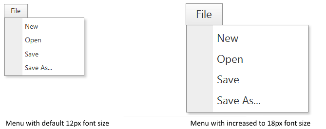
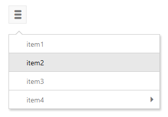

# Responsive Adaptive and Elastic Capabilities


This article explains the **responsive design capabilities RadMenu offers**. The [Lightweight RenderMode]() of RadMenu supports **elastic design since Q1 2014**.

Generally, responsive design means that the page and its content are able to adapt to different screen resolutions without deteriorating the user experience. This often includes changing the font size and having dimensions set in percent.

## Elastic Design with RadMenu
>caption Figure 1: Comparison between appearance of a RadMenu with regular font size and with increased font size



**RadMenu** in **Lightweight RenderMode** supports **changing the font size** without breaking the control's appearance - if the new size is larger than the original, the elements in the control will simply increase their size as well to accommodate the text. This fluid layout is achieved by using `em` units for setting dimensions and paddings in the control, instead of `px` because `em` units are tied to the font size. This allows dimensions and sizes to scale with the font size.

The following sample shows how to increase the font size of a RadMenu and the effect can be seen in comparison in Figure 1.

````ASP.NET
<style type="text/css">
    div.RadMenu {
        font-size: 18px;
    }
</style>
<telerik:RadMenu ID="RadMenu1" runat="server" RenderMode="Lightweight" >
    <Items>
        <telerik:RadMenuItem Text="File">
            <Items>
                <telerik:RadMenuItem Text="New"></telerik:RadMenuItem>
                <telerik:RadMenuItem Text="Open"></telerik:RadMenuItem>
                <telerik:RadMenuItem Text="Save"></telerik:RadMenuItem>
                <telerik:RadMenuItem Text="Save As..."></telerik:RadMenuItem>
            </Items>
        </telerik:RadMenuItem>
    </Items>
</telerik:RadMenu>
````


## Mobile Rendering

As of Q1 2014 we introduced the **Mobile** rendering mode for the **RadMenu** control. It is specifically designed to be used in mobile devices where its behavior is relatively different from the one on a desktop device. With the Mobile rendering of the RadMenu you also have the following capabilities:

* You still can choose among the different skins of the control;

* Easy markup;

* Multi-level menu support;

* Light-weight code;

* Multiple menus on the same page.
>caption Figure 1. Appearance of the RadMenu



More information about the functionalities that the RadMenu mobile render mode offers you can find [here]().
