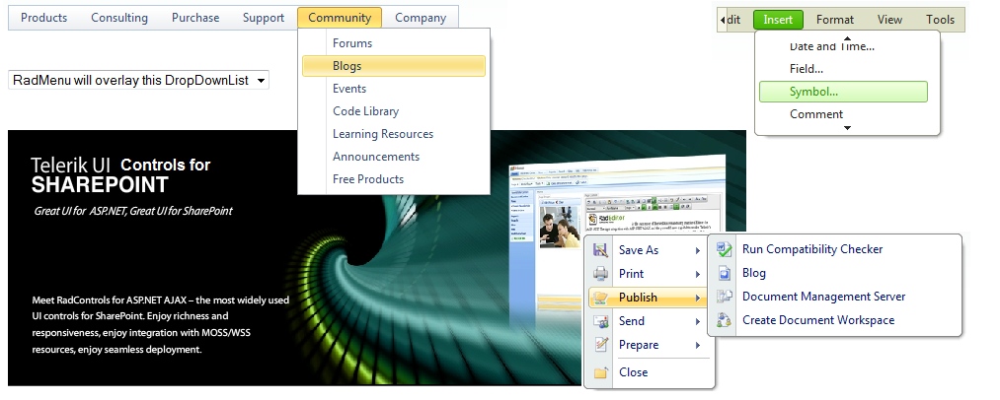

# Menu Overview

**Telerik RadMenu for ASP.NET AJAX** is a flexible navigation component for use in ASP.NET applications.

**Telerik RadContextMenu** is a related control that shares the powerful features of **RadMenu**, but which acts as a context menu or popup menu. 

#### Key Features
Using **RadMenu** and **RadContextMenu**, you get

* A [client-side API]() that includes the ability to add, remove and update menu items and have these changes persist after a postback to the server.

* Numerous options in how to define the item hierarchy, including

* [Defining items statically at design time]().

* [Creating items dynamically in server-side code]().

* [Creating items dynamically in client-side code]().

* [Loading Items from an XML file or string]().

* [Loading Items from a Web Service]().

* [Binding to all ASP.NET declarative DataSource components](), including **SiteMapDataSource**.

* Extensive [keyboard support](), covering both web (access keys and tab) and windows (arrows).

* Many options for [controlling appearance](), including

* The ability to [add images to items]()

* Control over the [layout of items]().

* [Animations]() to customize the way child items appear and disappear.

* Built-in [skins]() to quickly change the look and feel.

* [Style sheet support for individual items]().

* The ability to create your own [custom skins]().

* Support for [right-to-left locales]().

* Support for [templates]().

* [Custom attributes]() to extend the capabilities of the menu items.

* Lightweight markup (no tables).

* **Overlay support**. RadMenu can display its items over IE windowed objects suchHTML select boxes, Flash movies, and so on. This built-in feature does not need to be set explicitly through a property.

* **Screen boundary detection**.The list of child items expands to the opposite direction when necessary to prevent screen boundaries from being crossed.

* [Cross-page postbacks](), which let you direct postbacks from the menu to a different Web page.

* Support for [ASP.NET validation]().

* Support for all major browsers, including Internet Explorer 5.5 and above, Netscape 7.0 and above (PC -- Netscape 7.1 for Mac and Linux), Mozilla 1.0 and above (all operating systems),Firefox 0.8 and above (all operating systems), Opera 7.5 and above, and Safari 1.3 and above.

