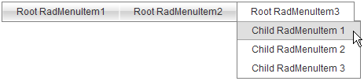

# Declaring Items Statically at Design Time

## 

It is easy to define the hierarchy of menu items statically at design time. You can use the [RadMenu Item Builder]() to create the hierarchy in the Visual Studio Designer:
>caption 


Alternately, you can use the Source page to specify the items declaratively:

````ASP.NET
<telerik:RadMenu RenderMode="Lightweight" ID="RadMenu1" runat="server" Flow="Horizontal" Skin="Gray">
    <Items>
        <telerik:RadMenuItem runat="server" ExpandMode="ClientSide" Text="Root RadMenuItem1">
            <Items>
                <telerik:RadMenuItem runat="server" ExpandMode="ClientSide" Text="Child RadMenuItem 1" />
            </Items>
        </telerik:RadMenuItem>
        <telerik:RadMenuItem runat="server" ExpandMode="ClientSide" Text="Root RadMenuItem2">
            <Items>
                <telerik:RadMenuItem runat="server" ExpandMode="ClientSide" Text="Child RadMenuItem 1" />
            </Items>
        </telerik:RadMenuItem>
        <telerik:RadMenuItem runat="server" ExpandMode="ClientSide" Text="Root RadMenuItem3">
            <Items>
                <telerik:RadMenuItem runat="server" ExpandMode="ClientSide" Text="Child RadMenuItem 1" />
                <telerik:RadMenuItem runat="server" ExpandMode="ClientSide" Text="Child RadMenuItem 2" />
                <telerik:RadMenuItem runat="server" ExpandMode="ClientSide" Text="Child RadMenuItem 3" />
            </Items>
        </telerik:RadMenuItem>
    </Items>
</telerik:RadMenu>
````

The result is a hierarchy of menu items:


>caption 



# See Also

 * [Custom Attributes]()

 * [Overview]()
