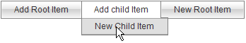

# Working With Items at Server-side


Using the server-side API, you can programmatically add, remove, and edit menu items.

## Adding Items on page load

After simply adding a RadMenu control to your Web page, use the following server-side code to add items when the page loads:


````C#
protected void Page_Load(object sender, EventArgs e)
{
    if (!Page.IsPostBack)
    {      
        RadMenuItem item1 = new RadMenuItem();
        item1.Text = "Item 1";
        RadMenuItem item11 = new RadMenuItem();
        item11.Text = "Child 1";      
        item1.Items.Add(item11);      
        RadMenuItem item2 = new RadMenuItem();
        item2.Text = "Item 2";      
        RadMenuItem item3 = new RadMenuItem();
        item3.Text = "Go to the Telerik site";
        item3.NavigateUrl = " http://www.telerik.com";
        RadMenu1.Items.Add(item1);
        RadMenu1.Items.Add(item2);
        RadMenu1.Items.Add(item3);
    }
}		
````
````VB.NET
Protected Sub Page_Load(ByVal sender As Object, ByVal e As EventArgs) Handles Me.Load
    If Not Page.IsPostBack Then
        Dim item1 As New RadMenuItem()
        item1.Text = "Item 1"
        Dim item11 As New RadMenuItem()
        item11.Text = "Child 1"
        item1.Items.Add(item11)
        Dim item2 As New RadMenuItem()
        item2.Text = "Item 2"
        Dim item3 As New RadMenuItem()
        item3.Text = "Go to the Telerik site"
        item3.NavigateUrl = "http://www.telerik.com"
        RadMenu1.Items.Add(item1)
        RadMenu1.Items.Add(item2)
        RadMenu1.Items.Add(item3)
    End If
End Sub
````


## Adding items dynamically

You can dynamically update the **Items** collection of **RadMenu** and **RadMenuItem** in response to a postback as well. Consider the following menu declaration:

````ASP.NET
<telerik:RadMenu RenderMode="Lightweight" ID="RadMenu1" runat="server" Flow="Horizontal" Skin="Gray" OnItemClick="RadMenu1_ItemClick">
    <Items>
        <telerik:RadMenuItem runat="server" ExpandMode="ClientSide" Text="Add Root Item"
            Value="R">
        </telerik:RadMenuItem>
        <telerik:RadMenuItem runat="server" ExpandMode="ClientSide" Text="Add child Item"
            Value="C">
        </telerik:RadMenuItem>
    </Items>
</telerik:RadMenu>
````

The **[ItemClick event handler]()** adds items dynamically at runtime in the post-back:


````C#
protected void RadMenu1_ItemClick(object sender, RadMenuEventArgs e)
{   
    switch (e.Item.Value)
    {
        case "R":
            // add a new root item  
            RadMenuItem RootItem = new RadMenuItem();        
            RootItem.Text = "New Root Item"; 
            RadMenu1.Items.Add(RootItem);
            break;      
        case "C": 
            // add a new child item        
            RadMenuItem ChildItem = new RadMenuItem();
            RadMenuItem ParentItem = e.Item; 
            ChildItem.Text = "New Child Item";
            ParentItem.Items.Add(ChildItem);
            break;
    }
}			
````
````VB.NET
Protected Sub RadMenu1_ItemClick(ByVal sender As Object, ByVal e As RadMenuEventArgs) Handles RadMenu1.ItemClick
    Select Case e.Item.Value
        Case "R"
            ' add a new root item   
            Dim RootItem As New RadMenuItem()
            RootItem.Text = "New Root Item"
            RadMenu1.Items.Add(RootItem)
            Exit Select
        Case "C"
            ' add a new child item   
            Dim ChildItem As New RadMenuItem()
            Dim ParentItem As RadMenuItem = e.Item
            ChildItem.Text = "New Child Item"
            ParentItem.Items.Add(ChildItem)
            Exit Select
    End Select
End Sub
````


Clicking on both menu items results in the following:



## Removing, disabling, and enabling items

To remove a menu item in server-side code, use the **Remove** method of the **RadMenuItemCollection** object that contains it. To enable or disable a menu item, use the **Enabled** property of the **RadMenuItem** object itself. The following example demonstrates these techniques:

Consider the following menu:

````ASP.NET
<telerik:RadMenu RenderMode="Lightweight" ID="RadMenu1" runat="server" OnItemClick="RadMenu1_ItemClick">
    <Items>
        <telerik:RadMenuItem runat="server" ExpandMode="ClientSide" Text="Delete an Item"
            Value="D">
            <Items>
                <telerik:RadMenuItem runat="server" ExpandMode="ClientSide" Text="Child 1" />
                <telerik:RadMenuItem runat="server" ExpandMode="ClientSide" Text="Child 2" />
                <telerik:RadMenuItem runat="server" ExpandMode="ClientSide" Text="Child 3" />
                <telerik:RadMenuItem runat="server" ExpandMode="ClientSide" Text="Child 4" />
            </Items>
        </telerik:RadMenuItem>
        <telerik:RadMenuItem runat="server" ExpandMode="ClientSide" Text="Disable an Item"
            Value="E">
            <Items>
                <telerik:RadMenuItem runat="server" ExpandMode="ClientSide" Text="Child 1" />
                <telerik:RadMenuItem runat="server" ExpandMode="ClientSide" Text="Child 2" />
                <telerik:RadMenuItem runat="server" ExpandMode="ClientSide" Text="Child 3" />
                <telerik:RadMenuItem runat="server" ExpandMode="ClientSide" Text="Child 4" />
            </Items>
        </telerik:RadMenuItem>
    </Items>
</telerik:RadMenu>
````

The **ItemClick** event handler deletes child items of the first root item dynamically at runtime in the post-back. It disables a clicked child item of the second root item, and enables all of its siblings:


````C#
protected void RadMenu1_ItemClick(object sender, RadMenuEventArgs e)
{  
    if (e.Item.Owner is RadMenuItem)
    {    
        RadMenuItem parentItem = (RadMenuItem)e.Item.Owner;
        switch (parentItem.Value)
        {      
            case "D" :        
                parentItem.Items.Remove(e.Item);
                break;                      
            case "E" :        
                for (int i = 0; i < parentItem.Items.Count; i++)
                {           
                    parentItem.Items[i].Enabled = (parentItem.Items[i] != e.Item);
                }        
                break;                        
        }  
    }
}		
````
````VB.NET
Protected Sub RadMenu1_ItemClick(ByVal sender As Object, ByVal e As RadMenuEventArgs) Handles RadMenu1.ItemClick
    If TypeOf e.Item.Owner Is RadMenuItem Then
        Dim parentItem As RadMenuItem = DirectCast(e.Item.Owner, RadMenuItem)
        Select Case parentItem.Value
            Case "D"
                parentItem.Items.Remove(e.Item)
                Exit Select
            Case "E"
                Dim i As Integer = 0
                While i < parentItem.Items.Count
                    parentItem.Items(i).Enabled = (parentItem.Items(i) <> e.Item)
                    i = i + 1
                End While
                Exit Select
        End Select
    End If
End Sub
````


# See Also

 * [Working With Items at Client-side]()

 * [Overview]()

 * [Methods and Properties]()
