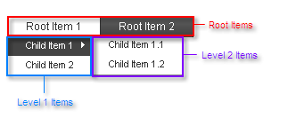

# Structure

## 

The structure of the **RadMenu** control is as follows:



The menu consists of a hierarchy of items. The items on one level are exposed when the parent item on the previous level is expanded. Each Item is represented by a **RadMenuItem** instance.

* At the top level are the **root items**. These items are always visible. They are available using the Items property of the menu control (**RadMenu.Items**).

* Each root item may have, nested within it, a set of child items. Children of the root items are considered **level 1 items**. They are available using the Items property of the root item (**RadMenuItem.Items**)

* Child items may have, nested within them, their own sets of child items. Children of level 1 items are considered **level 2 items**; children of level 2 items are considered **level 3 items**; and so on.

If the items are created at design time, the hierarchy is reflected in the ASP.NET declaration of the menu:

````ASPNET
<telerik:RadMenu ID="RadMenu1" runat="server" Flow="Horizontal">
	<Items>
		<telerik:RadMenuItem runat="server" Text="Root Item 1">
			<Items>
				<telerik:RadMenuItem runat="server" Text="Child Item 1">
					<Items>
						<telerik:RadMenuItem runat="server" Text="Child Item 1.1" />
						<telerik:RadMenuItem runat="server" Text="Child Item 1.2" />
					</Items>
				</telerik:RadMenuItem>
				<telerik:RadMenuItem runat="server" Text="Child Item 2" />
			</Items>
		</telerik:RadMenuItem>
		<telerik:RadMenuItem runat="server" Text="Root Item 2">
			<Items>
				<telerik:RadMenuItem runat="server" Text="Child Item 2.1" />
			</Items>
		</telerik:RadMenuItem>
	</Items>
</telerik:RadMenu>
````


# See Also

 * [Overview]()

 * [Declaring Items Statically at Design Time]()

 * [Overview]()
