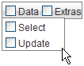

# DataBinding expressions


## 

Often, when you use item templates, you want the controls in the template to display information associated with the menu item properties. For example, consider a simple menu with a check box in the item template:

````ASPNET
	    <telerik:RadMenu ID="RadMenu1" runat="server" Flow="Horizontal" Skin="Gray">
	        <Items>
	            <telerik:RadMenuItem runat="server" ExpandMode="ClientSide" Text="Data">
	                <GroupSettings ExpandDirection="Auto" Flow="Vertical" />
	                <Items>
	                    <telerik:RadMenuItem runat="server" ExpandMode="ClientSide" Text="Select">
	                        <GroupSettings ExpandDirection="Auto" Flow="Vertical" />
	                    </telerik:RadMenuItem>
	                    <telerik:RadMenuItem runat="server" ExpandMode="ClientSide" Text="Update">
	                        <GroupSettings ExpandDirection="Auto" Flow="Vertical" />
	                    </telerik:RadMenuItem>
	                </Items>
	            </telerik:RadMenuItem>
	            <telerik:RadMenuItem runat="server" ExpandMode="ClientSide" Text="Extras">
	                <Items>
	                    <telerik:RadMenuItem runat="server" ExpandMode="ClientSide" Text="Color">
	                        <GroupSettings ExpandDirection="Auto" Flow="Vertical" />
	                    </telerik:RadMenuItem>
	                    <telerik:RadMenuItem runat="server" ExpandMode="ClientSide" Text="Sound">
	                        <GroupSettings ExpandDirection="Auto" Flow="Vertical" />
	                    </telerik:RadMenuItem>
	                </Items>
	                <GroupSettings ExpandDirection="Auto" Flow="Vertical" />
	            </telerik:RadMenuItem>
	        </Items>
	        <ItemTemplate>
	            <asp:CheckBox ID="CheckBox1" runat="server" />
	        </ItemTemplate>
	    </telerik:RadMenu>
````


When you run the application, the RadMenu items all show check boxes with no labels:

This is hardly useful! To override the __Text__ property of the check box in the template, use a __DataBinder.Eval__ statement:

````ASPNET
	    <itemtemplate>    
	        <asp:CheckBox ID="CheckBox1" runat="server" Text='<%# DataBinder.Eval(Container, "Text") %>'/>
	    </itemtemplate>
````


In the DataBinder.Eval statement, __Container__ is the RadMenuItem and __"Text"__ identifies the __Text__ property of that item. (If you wanted to bind to the __Value__ property, for example, you could use the string "Value" instead.)

>note In this example, the first parameter to the DataBinder.Eval statement is __Container__ , because the items are statically bound. If the menu was bound to a data source, then you must use __Container.DataItem__ instead. e.g.<%#DataBinder.Eval(Container.DataItem, "TextField") %>
>


In addition to adding a DataBinder.Eval statement, you must also explicitly call the DataBind method for the items so that the template has access to the __Text__ property:

>tabbedCode

````C#
	    protected void Page_Load(object sender, EventArgs e) { 
	        for (int i = 0; i < RadMenu1.Items.Count; i++) 
	        { 
	            RadMenu1.Items[i].DataBind(); 
	        } 
	    }
````
````VB.NET
	    Protected Sub Page_Load(ByVal sender As Object, ByVal e As EventArgs) Handles Me.Load
	        Dim i As Integer = 0
	        While i < RadMenu1.Items.Count
	            RadMenu1.Items(i).DataBind()
	            i = i + 1
	        End While
	    End Sub
````
>end

Now the text of the menu items appears on the check boxes:



# See Also

 * [Overview]()
