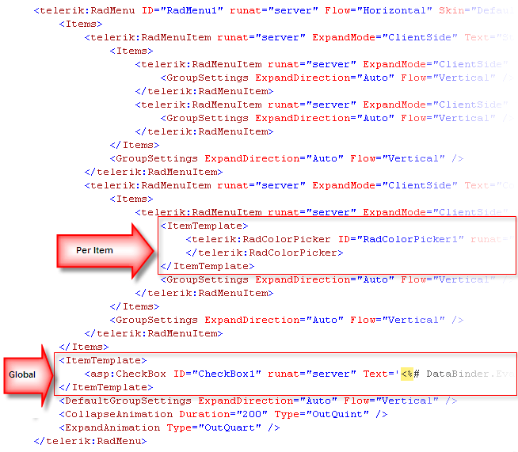
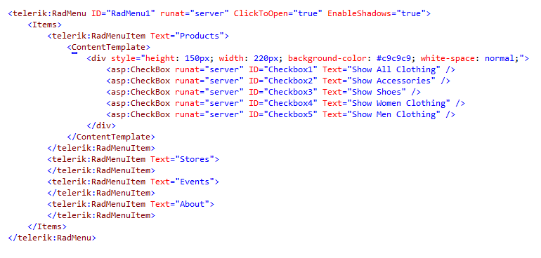

# Templates Overview

## 

**RadMenu** items are extremely configurable. In addition to the preset [skins](), you can customize the appearance of menu items by [adding custom images](), using [CSS classes](), or [creating custom skins](). However, if you want to embed other HTML controls in a menu item, you must use templates. You can embed any content inside a **RadMenu** template, including:

* HTML markup

* ASP.NET server controls

* Other third-party controls (including other Telerik controls)

At design time, add item templates to your **RadMenu** control using the [Template Design Surface](). **RadMenu** supports several types of item templates:

1. The global **RadMenuItem** template affects the appearance of all items in the menu.

1. Individual **Item** template affects the appearance of a single menu item, overriding the global **RadMenuItem** template if it is set (see Figure 1.).
>caption Figure 1. Using ItemTemplate

1. A **ContentTemplate** that allows you to customize only single items from the menu.

>note As of **Q1 2014** release of the Telerik controls you can also use the specially created **ContentTemplate** that allows you to modify the content (where normally the child items would reside)of a single menu item as desired.
>

>caption Figure 2. Using ContentTemplate

>note In addition to the item templates, **RadMenu** also supports a **Loading Status** template, which acts as a placeholder for a child group that is [loaded from a Web service]() while a request for items is being serviced.
>

For live examples of using templates, see [Templates](https://demos.telerik.com/aspnet-ajax/Menu/Examples/Functionality/Templates/DefaultCS.aspx) and [Multi-column Menus](https://demos.telerik.com/aspnet-ajax/Menu/Examples/MultiColumnMenu/DefaultCS.aspx).

>caution If you add templates at runtime, assigning an object that implements the **ITemplate** interface to the **ItemTemplate** property, the template only works with items added at runtime in the codebehind.
>

>caution If you add items via a **WebService**, templates will not be applied to these items.
>

>caution In Mobile render mode, RadMenu does not support Templates and images cannot be added to menu items by using their ImageUrl property.
>

# See Also

 * [Client Templates]()

 * [Server Templates]()

 * [Accessing Controls Inside Templates]()

 * [DataBinding expressions]()
