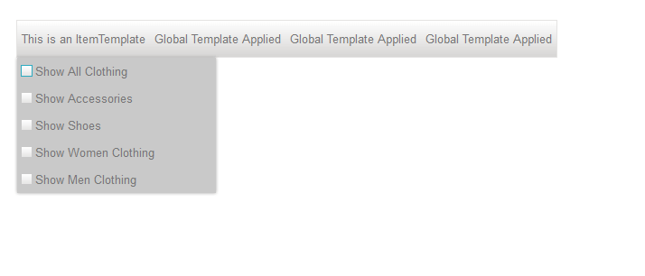
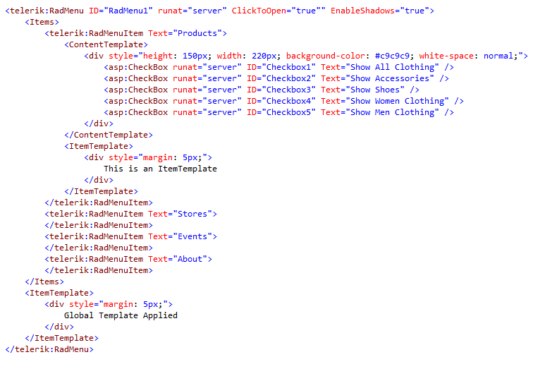

# Server Templates

## Content Templates

>note As of __Q1 2014__ release of the Telerik controls you can use the specially created __ContentTemplate__ that allows you to modify the content (where normally the child items would reside)of a single menu item as desired.
>

You can use the __ContentTemplate__ of a menu item with either root items or child items.However, when the __ContentTemplate__ is used no child items can be set to the item containingthe template and the content in the template is used instead. Thus, you can modify the contentof the menu item as desired – you can style it, place different HTML elements, Telerik controlsas well as third-party controls. If you use __ItemTemplate__ and __ContentTemplate__ at the same time, the first will be applied directly to the item while the second will be applied instead of child item.Finally, if there is a global template and a __ContentTemplate__ on some item,the content template will take precedence.

>note Note that once you set the __ContentTemplate__ to an item, this item cannot have child items.In contrast to that however, an item can have both an individual __ItemTemplate__ and a __ContentTemplate__ – the ItemTemplate is applied directly to the item while the __ContentTemplate__ is used as a contained that holds.
>

## Item Templates

You can use the __ItemTemplate__ for both setting template to a single menu item andto all items in a menu (applied as global template). For example you can set a global template to all menu itemsand if you need to further customize only a single or several items you can do so by applying the __ItemTemplate__ again only to the needed items.

## Example

The following example (Figure 1.) shows a menu that uses a global template on child items and a content template.The first root level item uses both __ContentTemplate__ and an __ItemTemplate__ thatoverride the global template of the menu items:
>caption Figure 1. Using ItemTemplate, ContentTemplate and global templates

>caption Figure 2. Markup code used for the menu with ItemTemplate, ContentTemplate and global templates

# See Also

 * [Overview]()

 * [Accessing Controls Inside Templates]()

 * [Mega DropDown Menu Demo](http://demos.telerik.com/aspnet-ajax/menu/examples/megadropdown/defaultcs.aspx)
