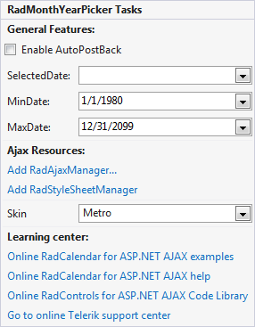

# Smart Tag

The **Smart Tag** allows easy access to frequently needed tasks. You can display it by right clicking on a control in the design window, and choosing **Show Smart Tag** from its context menu.

## Ajax Resources

* **Add RadAjaxManager** - adds a **RadAjaxManager** component to your Web page, and displays the **RadAjax Property Builder** where you can configure it.

* **Replace ScriptManager with RadScriptManager** - replaces the default **ScriptManager** component that is added for AJAX-enabled Web sites with **RadScriptManager**.

* **Add RadStyleSheetManager** - adds a **RadStyleSheetManager** to your Web page.

## Skin

The **Skin** drop-down lets you select from a list of available Skins to customize the look of your **RadMonthYearPicker** control.

## Learning Center

Links navigate you directly to **RadMonthYearPicker** examples, help, or Code Library. You can also search the Telerik web site for a given string.

## RadMonthYearPicker

The **RadMonthYearPicker** Smart Tag contains the same **Ajax Resources**, **Skin** and **Learning Center** sections as the **RadCalendar** control. In addition, the **RadMonthYearPicker** Smart Tag lets you do the following.

## RadMonthYearPicker Tasks

* **Enable AutoPostBack** - lets you enable or disable postbacks when the user selects a date using the **RadDatePicker** input area or popup calendar.

* **SelectedDate** - lets you initialize the value of the **RadDatePicker** control to a date you select from a popup calendar.

* **MinDate** and **MaxDate** - specify the range of valid dates that the user can enter into the **RadMonthYearPicker** control.

