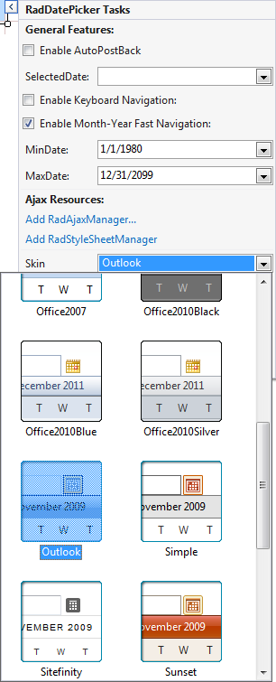
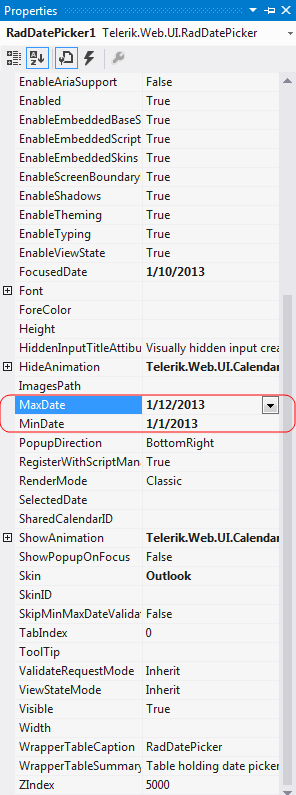

# Getting Started Overview

This tutorial will walk you through creating a Web page that uses **RadMonthYearPicker** control.

## Adding a RadMonthYearPicker control

1. Drag a **RadMonthYearPicker** control from the toolbox onto your Web Page, below the **RadCalendar** control.

2. In the **RadMonthYearPicker** [Smart Tag]() that appears automatically, choose "Outlook" from the drop-down list for the **Skin** property:

3. Set the **MinDate** and **MaxDate** properties to specify the range of valid dates that the user can enter into the **RadDatePicker** control**.

# See Also

 * [RadMonthYearPicker Structure]()
 
 
