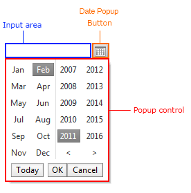

# RadMonthYearPicker Structure

The **RadMonthYearPicker** control is composite control that combines the functionality of **RadCalendar** with the functionality of **RadDateInput** to give the broadest possible range of options for selecting month and year values. The control elements are described below:

The three major components of a **RadMonthYearPicker** control are:

* **Input area** - This is an embedded **RadDateInput** control, which validates dates or times as the user types.

* **Popup control** - This is a **MonthYearPickerTableView** that is shown in a popup element, so that the user can select a month or year by clicking on the desired selection.

* **Date Popup Button** - an image button, displayed next to the input area that shows and hides the popup control.

# See Also

 * [RadCalendar Structure]()

 * [RadMonthYearPicker Structure]()
 
 
