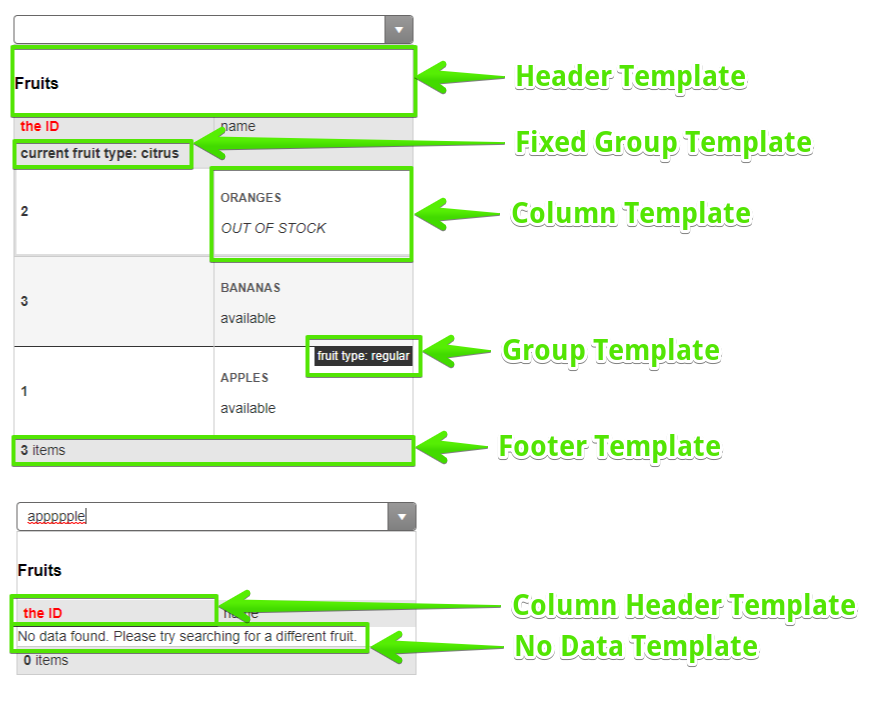

# Templates

**RadMultiColumnComboBox** uses [Kendo UI Templates](https://docs.telerik.com/kendo-ui/framework/templates/overview) to provide full control over the way pop-up items are rendered in the dropdown:

- [Templates](#templates)
	- [Column Template](#column-template)
	- [Column Header Template](#column-header-template)
	- [Header Template](#header-template)
	- [Footer Template](#footer-template)
	- [No Data Template](#no-data-template)
	- [Group Template](#group-template)
	- [Fixed Group Template](#fixed-group-template)
	- [See Also](#see-also)

>caption Figure 1: Structure of the dropdown and where you can use templates. Produced by the code in Example 1 below.




>caption Example 1: Sample use of templates in RadMultiColumnComboBox. The result is shown in Figure 1 above.
    
````ASP.NET
<telerik:RadMultiColumnComboBox runat="server" ID="RadMultiColumnComboBox1" Skin="Default"
	DataTextField="name" DataValueField="id" FilterFields="id,name,fruitType" Filter="contains"
	GroupByField="fruitType" Width="400px" Height="400px">
	<ColumnsCollection>
		<telerik:MultiColumnComboBoxColumn Field="id">
			<HeaderTemplate>
				<strong class="red">the ID</strong>
			</HeaderTemplate>
			<Template><strong>#:data.id#</strong></Template>
		</telerik:MultiColumnComboBoxColumn>
		<telerik:MultiColumnComboBoxColumn Field="name">
			<Template>
				<h6>#:data.name#</h6>
				<p>
					#if(!data.isAvailable) { #
					<span class="outOfStock">Out of stock</span> 
					# } else { #
					available
					# }#
				</p>
			</Template>
		</telerik:MultiColumnComboBoxColumn>
	</ColumnsCollection>
	<HeaderTemplate>
		<div><h2>Fruits</h2></div>
	</HeaderTemplate>
	<FooterTemplate>
		<strong>#: instance.dataSource.total() #</strong> items
	</FooterTemplate>
	<GroupTemplate>
		fruit type: #:data#
	</GroupTemplate>
	<FixedGroupTemplate>
		<strong>current fruit type: #:data#</strong>
	</FixedGroupTemplate>
	<NoDataTemplate>
		No data found. Please try searching for a different fruit.
	</NoDataTemplate>
	<ClientEvents OnLoad="OnLoad" />
</telerik:RadMultiColumnComboBox>
<script>
	function OnLoad(sender, args) {
		var dataSource = new kendo.data.DataSource({
			data: [
				{ id: 1, name: "Apples", isAvailable: true, fruitType: "regular" },
				{ id: 2, name: "Oranges", isAvailable: false, fruitType: "citrus" },
				{ id: 3, name: "Bananas", isAvailable: true, fruitType: "citrus" }
			],
			group: { field: "fruitType" }
			//clone the GroupByField setting because
			//this data source was not created by the RadMultiColumnComboBox
			//and it cannot set its settings otherwise
		});
		sender.set_dataSource(dataSource);
	}
</script>
<style>
	/* You can also use CSS to style elements in the templates */
	.red {
		color: red;
	}

	.outOfStock {
		font-style: italic;
		text-transform: uppercase;
	}
</style>
````


## Column Template

This is the template that is rendered in each individual column. It receives the `data` parameter that points to the dataItem for the corresponding item, so you can use all its data source fields. The data from the attributes can be accessed via `attributes.AttributeKeyName` parameter.

````ASP.NET
<telerik:RadMultiColumnComboBox DataTextField="Name" DataValueField="Id" runat="server" ID="RadMultiColumnComboBox1">
	<ColumnsCollection>
		<telerik:MultiColumnComboBoxColumn Field="Id" Width="30px" Title="Id" />
		<telerik:MultiColumnComboBoxColumn Field="Title" Width="250px">
			<Template>
				Position of <strong>#:data.Title#</strong>: #: attributes.customAttrText #
			</Template>
		</telerik:MultiColumnComboBoxColumn>
	</ColumnsCollection>
</telerik:RadMultiColumnComboBox>
````

````C#
protected void Page_Load(object sender, EventArgs e)
{
	var items = Enumerable.Range(0, 10).Select(x => new MyClass() { Id = x, Name = "Name " + x, Title = "Title " + x });
	RadMultiColumnComboBox1.DataSource = items;
	RadMultiColumnComboBox1.DataBind();
	foreach (var item in RadMultiColumnComboBox1.Items)
	{
		item.Attributes.Add("customAttrText", "#" + item.Value);
	}
}
public class MyClass
{
	public int Id { get; set; }
	public string Name { get; set; }
	public string Title { get; set; }
}
````


## Column Header Template

This is the template that renders in the header of each individual column. It does not receive arguments because it is not bound to data, but is a presentational element with static HTML.

## Header Template

A template that shows above all columns. It is not bound to data and is static HTML.

## Footer Template

This is the shared footer below all columns. It renders on every change of the data source and can reflect changes in the number of found items after filtering. The context of the footer template is the underlying Kendo Widget itself that you can access through the `instance` argument.

## No Data Template

This template is shown when the data source is empty or the current filter operation returned no results. The template will be evaluated on every widget data bound. The No Data template receives the widget itself as a part of the `data` argument.

## Group Template

The template for the header of the group that is not the current topmost group. By default the value of the field by which the data is grouped is displayed and it is sent to the template via the `data` argument.

## Fixed Group Template

The template for the current (topmost) group. It renders just below the column headers and uses the current filter field value by default. This value is sent to the template via the `data` argument.

## See Also

* [Live Demo - Templates](https://demos.telerik.com/aspnet-ajax/multicolumncombobox/templates/defaultcs.aspx)

* [Kendo UI MultiColumnComboBox Widget API Reference](https://docs.telerik.com/kendo-ui/api/javascript/ui/multicolumncombobox)

