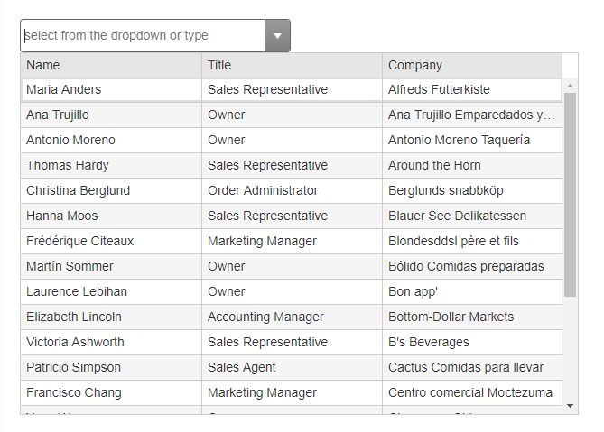

# Getting Started with the Telerik WebForms MultiColumnComboBox


The following tutorial demonstrates how you can add **RadMultiColumnComboBox** bound to SqlDataSource control. The end result will be similar to **Figure 1**:

>caption Figure 1: RadMultiColumnComboBox bound to SqlDataSource control



Add a **ScriptManager** control on a Web Form. After thatm, create a data source with your preferred method. For example:

````ASP.NET
    <asp:SqlDataSource runat="server" ID="SqlDataSource1" ConnectionString="<%$ ConnectionStrings:NorthwindConnectionString %>"
    ProviderName="System.Data.SqlClient"
    SelectCommand="SELECT Top 20 [CustomerID], [ContactName], [ContactTitle], [CompanyName] FROM [Customers]"></asp:SqlDataSource>
````

Add a **RadMultiColumnComboBox** control to the page, and set its properties:

* `DataSourceID` - points to the SqlDataSource control ID.
* `DataTextField` and `DataValueField` - point them to the respective fields of the data source.
* `FilterFields` - these are the fields from the data source that will be used for filtering the text the user types. Set them according to the data source and your UX preferences.
* `Filter` - set it to "`contains`" to enable generic filtering.
* `Placeholder`, `DropDownWidth`, `Height` and `Width` control its appearance much like with other inputs and dropdowns.
* `HighlightFirst` - by default, the first search result will be highlighted. You can disable this functionnality by setting the value to **false**.
* Populate the `ColumnsCollection` with `MultiColumnComboBoxColumn` instances and set their properties:

    * `Field` - the field from the data source that will be rendered.
    * `Title` - the header text.
    * `Width` - the width of the column. They should add up to the value of DropDownWidth.
    
The end result should be similar to the following:

````ASP.NET
    <telerik:RadMultiColumnComboBox runat="server" ID="RadMultiColumnComboBox1" DataSourceID="SqlDataSource1"
        DropDownWidth="600px" Height="400px" Width="100%" HighlightFirst="true"
        Filter="contains" FilterFields="ContactName, ContactTitle, CompanyName"
        DataTextField="ContactName" DataValueField="CustomerID"
        Placeholder="select from the dropdown or type" Skin="Default">
        <ColumnsCollection>
            <telerik:MultiColumnComboBoxColumn Field="ContactName" Title="Name" Width="200px" />
            <telerik:MultiColumnComboBoxColumn Field="ContactTitle" Title="Title" Width="200px" />
            <telerik:MultiColumnComboBoxColumn Field="CompanyName" Title="Company" Width="200px" />
        </ColumnsCollection>
    </telerik:RadMultiColumnComboBox>
````
 
  
   
