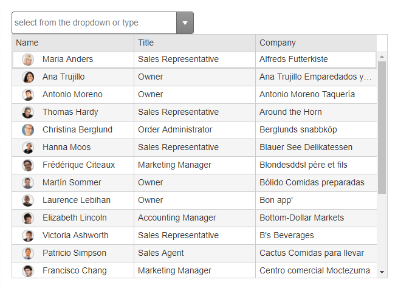

# MultiColumnComboBox Overview

RadMultiColumnComboBox is a server-side WebForms wrapper over the MultiColumnComboBox for Kendo UI for jQuery. It operates on the client and provides functionality similar to a regular dropdown, but with highly simplified approach for creating columns in the dropdown.

## Key Features

* Renders and operates on the client-side

* Built-in accessibility, WAI-ARIA, keyboard and RTL support

* Ability to cascade from another MultiColumnComboBox

* Client templates for all components in the dropdown

* Built-in grouping of the data

* Virtualization

* Client or server filtering

* Integration with both client-side and server-side data sources

* Rich client-side API and events

# See Also

 * [Overview demo](http://demos.telerik.com/aspnet-ajax/multicolumncombobox/overview/defaultcs.aspx)
