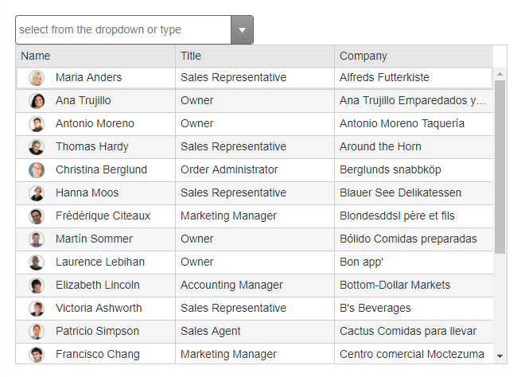

# MultiColumnComboBox Overview

RadMultiColumnComboBox is similar to a regular dropdown, and offers a highly simplified approach for creating columns in the dropdown.

RadMultiColumnComboBox is available as of R1 2019 and it is a server-side WebForms wrapper over the MultiColumnComboBox for Kendo UI for jQuery widget.

>caption Figure 1: RadMultiColumnComboBox allows you to create such a complex layout with [under 20 lines of markup](http://demos.telerik.com/aspnet-ajax/multicolumncombobox/overview/defaultcs.aspx).

## Key Features

* Renders and operates on the client-side

* Built-in accessibility, WAI-ARIA, keyboard and RTL support

* Ability to [cascade]() from another MultiColumnComboBox

* Client [templates]() for all components in the dropdown

* Built-in [grouping]() of the data

* [Virtualization]()

* Client or server [filtering]()

* Integration with both [client-side]() and server-side data sources

* Rich [client-side API]() and [events]()

# See Also

 * [Overview demo](http://demos.telerik.com/aspnet-ajax/multicolumncombobox/overview/defaultcs.aspx)
