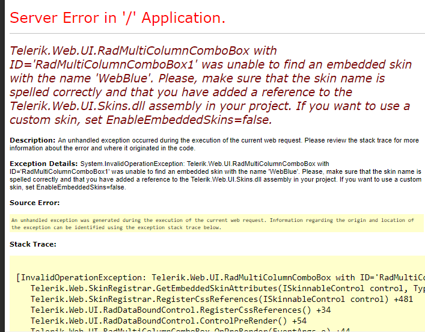

# Known Issues

This article lists known issues in the RadMultiColumnComboBox control.

## Failed to Created Designer

>note  **R2 2019** release introduces the Design-time for the RadMultiColumnComboBox control. The issue is present only in earlier versions.
>
 
RadMultiColumnComboBox does not support design-time at the moment.

When you open the Design-time surface of Visual Studio, RadMultiColumnComboBox instances will not render and will throw the `Failed to create designer` error.

>caption Figure 1: RadMultiColumnComboBox throws errors in design-time

## Cannot Find Embedded Skin

>note **R2 2019** release introduces multiple skins for the RadMultiColumnComboBox control. The issue is present only in earlier versions.
>

RadMultiColumnComboBox supports only the **Default** skin. 

Setting a different skin name will result in a runtime error like `Telerik.Web.UI.RadMultiColumnComboBox with ID='RadMultiColumnComboBox1' was unable to find an embedded skin with the name 'WebBlue'. Please, make sure that the skin name is spelled correctly and that you have added a reference to the Telerik.Web.UI.Skins.dll assembly in your project. If you want to use a custom skin, set EnableEmbeddedSkins=false.`.

>caption Figure 2: RadMultiColumnComboBox cannot use skins different than Default

