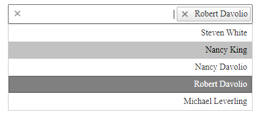

# Right-to-Left Support

The **RadMultiSelect** fully supports right-to-left (RTL) language locales (**Figure 1**). In order to turn on the RTL support you should set **dir=rtl** to the html or body element or at least to its parent element (**Figure 1**).  You can also use the **direction:rtl** CSS property. 

>caption Figure 1: RadMultiSelect in RTL mode.



>caption Example 1: Set the "direction: rtl" style to the **RadMultiSelect**'s wrapper element in order to enable the RTL support for the control.

````ASP.NET
<div dir="rtl" runat="server">
    <telerik:RadMultiSelect ID="RadMultiSelect1" runat="server" DataTextField="text" DataValueField="value" Filter="Contains" Width="400px"
        Placeholder="Select attendees...">
        <Items>
            <telerik:MultiSelectItem Text="Steven White" Value="1"></telerik:MultiSelectItem>
            <telerik:MultiSelectItem Text="Nancy King" Value="2"></telerik:MultiSelectItem>
            <telerik:MultiSelectItem Text="Nancy Davolio" Value="3"></telerik:MultiSelectItem>
            <telerik:MultiSelectItem Text="Robert Davolio" Value="4"></telerik:MultiSelectItem>
            <telerik:MultiSelectItem Text="Michael Leverling" Value="5"></telerik:MultiSelectItem>
        </Items>
    </telerik:RadMultiSelect>
</div>
````

## See Also

 * [Live Demo: RadMultiSelect RTL Support](http://demos.telerik.com/aspnet-ajax/multiselect/rtl/defaultcs.aspx)

 * [Keyboard Support]()
