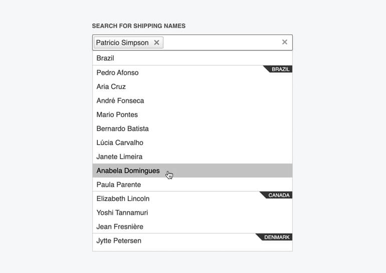

# Grouping

**RadMultiSelect** can group its data source based on the `GroupExpression` settings in the `WebServiceClientDataSource` tag. The `ClientDataSourceGroupExpression.FieldName` property holds the name of the field from the dataSource which will be used for the gruping.

The popup will show a header with the value of the field for each group, and a static header for the current group just below the column headers, so the user can see which group they are scrolling through regardless of the number of items in the control.




## Configuration

You can customize the headers through their [templates]().

Grouping requires binding the control to a web service, and grouping is performed on the client over the returned flat data.

Web service binding creates a [Kendo DataSource](https://docs.telerik.com/kendo-ui/framework/datasource/overview) and applies the grouping settings to it automatically. 


>caption Example 1: Grouping in RadMultiSelect with WebService binding

````ASP.NET
        <telerik:RadMultiSelect runat="server" Width="300px" ID="RadMultiSelect1"
            DataTextField="ContactName"
            DataValueField="CustomerID"
            DropDownHeight="400"
            Placeholder="Select customers...">
            <WebServiceClientDataSource>
                <WebServiceSettings ServiceType="OData">
                    <Select Url="https://demos.telerik.com/kendo-ui/service/Northwind.svc/Customers" />
                </WebServiceSettings>
                <GroupExpressions>
                    <telerik:ClientDataSourceGroupExpression FieldName="Country" />
                </GroupExpressions>
            </WebServiceClientDataSource>
        </telerik:RadMultiSelect>
````


>caption Example 2: Grouping in RadMultiSelect with server-side binding

````ASP.NET
<telerik:RadMultiSelect ID="RadMultiSelect1" DataTextField="Name" DataValueField="ID" DataKeyNames="GroupName" runat="server">
    <WebServiceClientDataSource>
        <GroupExpressions>
            <telerik:ClientDataSourceGroupExpression FieldName="GroupName"></telerik:ClientDataSourceGroupExpression>
        </GroupExpressions>
    </WebServiceClientDataSource>
</telerik:RadMultiSelect>
````

````C#
public class MyClass
{
    public int ID { get; set; }
    public string Name { get; set; }
    public string GroupName { get; set; }
}
protected void Page_Load(object sender, EventArgs e)
{
    var multiSelectDS = Enumerable.Range(1, 30).Select(x =>
    new MyClass
    {
        ID = x,
        Name = "Item #" + x,
        GroupName = "Group" + x % 5
    });

    RadMultiSelect1.DataSource = multiSelectDS;
    RadMultiSelect1.DataBind();
}
````

>caption Example 1: Grouping in RadMultiSelect created programmatically

````C#
public class MyClass
{
    public int ID { get; set; }
    public string Name { get; set; }
    public string GroupName { get; set; }
}
protected void Page_Load(object sender, EventArgs e)
{
    var multiSelectDS = Enumerable.Range(1, 30).Select(x =>
    new MyClass
    {
        ID = x,
        Name = "Item #" + x,
        GroupName = "Group" + x % 5
    });

    var RadMultiSelect2 = new RadMultiSelect();
    RadMultiSelect2.ID = "RadMultiSelect2";

    Form.Controls.Add(RadMultiSelect2);

    // Programmatic creation and configuration of GroupExression and data fields
    RadMultiSelect1.DataTextField = "Name";
    RadMultiSelect1.DataValueField = "ID";
    RadMultiSelect1.DataKeyNames = new string[] { "GroupName" };
    RadMultiSelect1.WebServiceClientDataSource.GroupExpressions.Add(new ClientDataSourceGroupExpression() { FieldName = "GroupName" });
}
````


## See Also

* [Live Demo - Grouping](https://demos.telerik.com/aspnet-ajax/multiselect/grouping/defaultcs.aspx)

* [Templates]()

* [Kendo Data Source Grouping Configuration](https://docs.telerik.com/kendo-ui/api/javascript/data/datasource/configuration/group)

