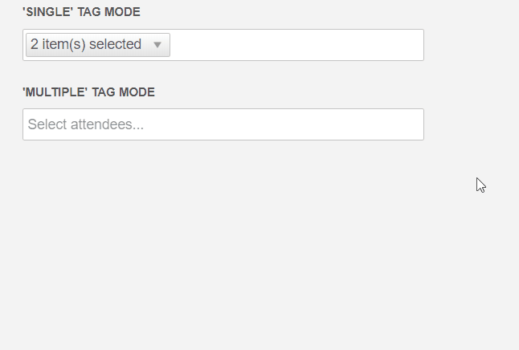

# Tag Mode

**RadMultiSelect** provides options for displaying the items as individual (multiple) tags and as a single, summary tag. The available modes are (you can see them in **Figure 1**):
 * `Single` - renders only one tag that shows the number of the selected values
 * `Multiple` - renders a tag for every selected value. This is the default tag mode.



Every `TagMode` has a specific `TagTemplate` value. You can control the content of the rendered tags by setting a custom a [TagTemplate]](#tag-template) value.

>caption Example 1: RadMultiSelect with single tag mode

````ASP.NET
<telerik:RadMultiSelect ID="RadMultiSelect1" runat="server"  Filter="Contains" Width="240px"
    DataTextField="text" DataValueField="value" TagMode="Single">
    <Items>
        <telerik:MultiSelectItem Text="Apples" Value="1"></telerik:MultiSelectItem>
        <telerik:MultiSelectItem Text="Oranges" Value="2"></telerik:MultiSelectItem>
        <telerik:MultiSelectItem Text="Bananas" Value="3"></telerik:MultiSelectItem>
        <telerik:MultiSelectItem Text="Cherries" Value="4"></telerik:MultiSelectItem>
    </Items>
</telerik:RadMultiSelect>
````

## See Also

* [Live Demo - Tag Mode](https://localdemos.telerik.com/aspnet-ajax-dev/multiselect/tagmode/defaultcs.aspx)