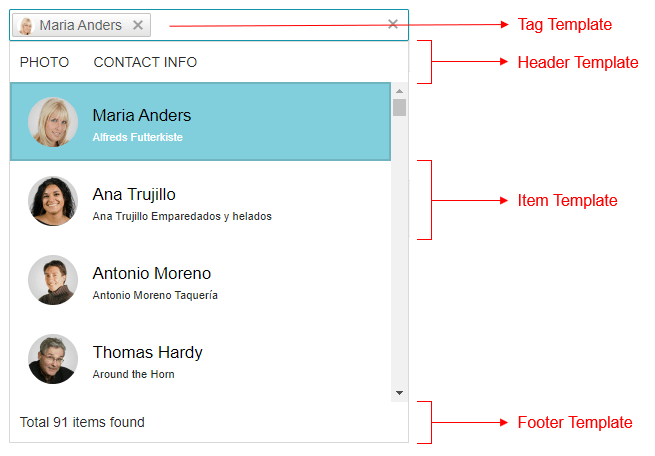

# Templates

**RadMultiSelect** uses [Kendo UI Templates](https://docs.telerik.com/kendo-ui/framework/templates/overview) to provide full control over the rendering of items, selected values, and popup headers. The control supports the following templates:

- [Templates](#templates)
  - [Item template](#item-template)
  - [Tag Template](#tag-template)
  - [Header Template](#header-template)
  - [Footer Template](#footer-template)
  - [Group Template](#group-template)
  - [Fixed Group Template](#fixed-group-template)
  - [No Data Template](#no-data-template)
  - [See Also](#see-also)

>caption Figure 1: Structure of the popup and where you can use templates. 



You can see the source code used for producing the image in [RadMultiSelect Templates Live demo](https://demos.telerik.com/aspnet-ajax/multiselect/customizingtemplates/defaultcs.aspx).

>caption Example 1: Sample use of templates in RadMultiSelect.
    
````ASP.NET
        <telerik:RadMultiSelect runat="server" Width="400px" ID="RadMultiSelect1"
            DataTextField="ContactName"
            DataValueField="CustomerID"
            DropDownHeight="400"
            CssClass="customers-wrapper"
            Placeholder="Select customers...">
            <ItemTemplate>
                <span class="k-state-default"><h3>#: data.ContactName #</h3><p>#: data.CompanyName #</p></span>
            </ItemTemplate>
            <TagTemplate>
                <span style="color:red;">#:data.ContactName#</span>
            </TagTemplate>
            <HeaderTemplate>
                <div style="color: darkgreen; font-size: 18px"> 
                    <span>Photo</span> 
                    <span>Contact info</span>
                </div>
            </HeaderTemplate>
            <FooterTemplate>
                <div style="color: gray; font-size: 14px"> 
                    Total #: instance.dataSource.total() # items found
                </div>
            </FooterTemplate>
            <NoDataTemplate>
                 No data found. Please try searching for a different customer.
            </NoDataTemplate>

            <WebServiceClientDataSource>
                <WebServiceSettings ServiceType="OData">
                    <Select DataType="JSONP" Url="https://demos.telerik.com/kendo-ui/service/Northwind.svc/Customers" />
                </WebServiceSettings>
            </WebServiceClientDataSource>
        </telerik:RadMultiSelect>
````

When **RadMultiSelect** is [bound on the server-side](), you can add custom attributes in the [ItemDataBound]() event that can be accessed in the templates through the `attributes` parameter:
````ASP.NET
<telerik:RadMultiSelect ID="RadMultiSelect1" runat="server" Filter="contains"
        DataTextField="Name" DataValueField="ID" OnItemDataBound="RadMultiSelect1_ItemDataBound">
    <ItemTemplate>
    <span>#:attributes.myAttribute#</span>
    </ItemTemplate>
</telerik:RadMultiSelect>
````

````C#
protected void Page_Load(object sender, EventArgs e)
{
    if (!IsPostBack)
    {
        RadMultiSelect1.DataSource = Enumerable.Range(1, 10).Select(x => new MyCustomItem()
        {
            ID = x,
            Name = "Name #" + x
        });

        RadMultiSelect1.DataBind();
    }
}

protected void RadMultiSelect1_ItemDataBound(object sender, Telerik.Web.UI.RadMultiSelectItemEventArgs e)
{
    e.Item.Attributes.Add("myAttribute", "Attribute " + e.Item.Value);
}

public class MyCustomItem
{
    public int ID { get; set; }
    public string Name { get; set; }
}
````
````VB
Protected Sub Page_Load(ByVal sender As Object, ByVal e As EventArgs)
    If Not IsPostBack Then
        RadMultiSelect1.DataSource = Enumerable.Range(1, 10).[Select](Function(x) New MyCustomItem() With {
    .ID = x,
    .Name = "Name #" & x
})
        RadMultiSelect1.DataBind()
    End If
End Sub

Protected Sub RadMultiSelect1_ItemDataBound(ByVal sender As Object, ByVal e As Telerik.Web.UI.RadMultiSelectItemEventArgs)
    e.Item.Attributes.Add("myAttribute", "Attribute " & e.Item.Value)
End Sub

Public Class MyCustomItem
    Public Property ID As Integer
    Public Property Name As String
End Class
````

## Item template

This is the template that is rendered in each individual column. It receives the `data` parameter that points to the dataItem for the corresponding item, so you can use all its data source fields

````ASP.NET
<telerik:RadMultiSelect runat="server" Width="400px" ID="RadMultiSelect1"
    DataTextField="ContactName"
    DataValueField="CustomerID">
    <ItemTemplate>
        <span class="k-state-default" style="background-image: url('https://demos.telerik.com/kendo-ui/content/web/Customers/#:data.CustomerID#.jpg')"></span>
        <span class="k-state-default"><h3>#: data.ContactName #</h3><p>#: data.CompanyName #</p></span>
    </ItemTemplate>
    <WebServiceClientDataSource>
        <WebServiceSettings ServiceType="OData">
            <Select DataType="JSONP" Url="https://demos.telerik.com/kendo-ui/service/Northwind.svc/Customers" />
        </WebServiceSettings>
    </WebServiceClientDataSource>
</telerik:RadMultiSelect>
<style>
    .RadMultiSelectDropDown .k-item > span:first-child {
        width: 50px;
        height: 50px;
        border-radius: 50%;
        background-size: 100%;
        background-repeat: no-repeat;
    }
</style>
````

## Tag Template

This is the [https://docs.telerik.com/kendo-ui/api/javascript/ui/multiselect/configuration/tagtemplate](https://docs.telerik.com/kendo-ui/api/javascript/ui/multiselect/configuration/tagtemplate) that manages the way the tag of a MultiSelect is rendered. It is not bound to data and is static HTML.

## Header Template

A [https://docs.telerik.com/kendo-ui/api/javascript/ui/multiselect/configuration/headertemplate](https://docs.telerik.com/kendo-ui/api/javascript/ui/multiselect/configuration/headertemplate) that shows above all items. It is not bound to data and is static HTML.

>caution The header content should be wrapped with an HTML tag if it contains more than one element. This is applicable also when header content is just a string/text.
>

## Footer Template

This is the [https://docs.telerik.com/kendo-ui/api/javascript/ui/multiselect/configuration/footertemplate](https://docs.telerik.com/kendo-ui/api/javascript/ui/multiselect/configuration/footertemplate) used to render the footer. The footer is re-rendered on every change of the Data Source. The context of the footer template is the underlying Kendo Widget itself that you can access through the `instance` argument.

## Group Template

The template for the header of the group that is not the current topmost group. By default the value of the field by which the data is grouped is displayed and it is sent to the template via the `data` argument.

## Fixed Group Template

The template for the current (topmost) group. It renders just below the column headers and uses the current filter field value by default. This value is sent to the template via the `data` argument.

## No Data Template

This [template](https://docs.telerik.com/kendo-ui/api/javascript/ui/multiselect/configuration/nodatatemplate) is shown when the data source is empty or the current filter operation returned no results.

>caution When the NoDataTemplate is defined, the MultiSelect always opens the popup element.
>


## See Also

* [Live Demo - Templates](https://demos.telerik.com/aspnet-ajax/multiselect/customizingtemplates/defaultcs.aspx)

* [Kendo UI MultiSelect Widget API Reference](https://docs.telerik.com/kendo-ui/api/javascript/ui/multiselect)

