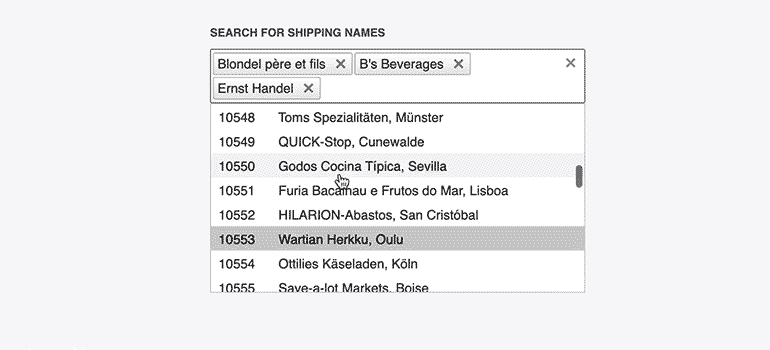

# Virtualization

**RadMultiSelect** supports virtualization of the data and the UI at the same time in order to improve both server and client performance for cases when you have large amounts of data. As the user scrolls through the list of items, new pages of data are requested and the existing DOM elements are reused to render them.



## Prerequisites

Virtualization requires:

* `DropDownHeight` and `VirtualSettings.ItemHeight` to be set in pixels. If you do not explicitly specify the height of the virtualized list container, the list will use the default height of 200px.
* Remote data binding.
* That the corresponding service provides the paging of the data. This means that the following properties must be set:
    * `WebServiceClientDataSource.PageSize` set according to the `DropDownHeight` and `ItemHeight` (usually `((DropDownHeight / ItemHeight) * 4)`)
    * `WebServiceClientDataSource.EnableServerFiltering="true"`
    * `WebServiceClientDataSource.AllowPaging="true"`
    * `WebServiceClientDataSource.EnableServerPaging="true"`

>important RadMultiSelect is a server-side wrapper over the Kendo UI MultiSelect widget. The [Virtualization in Kendo MultiSelect](https://docs.telerik.com/kendo-ui/controls/editors/multiselect/virtualization) article explains in detail how virtualization works in the underlying widgets, and lists its behaviors, specifics and requirements. You should get familiar with it before using virtualization in RadMultiSelect.

## Examples

The following example shows how you can use virtualization with the service from the [Kendo Service repo](https://github.com/telerik/kendo-ui-demos-service). It also includes a [sample value mapper](https://github.com/telerik/kendo-ui-demos-service/blob/master/demos-and-odata-v3/KendoCRUDService/Controllers/OrdersController.cs) function that is optional.

>caption Example 1: Virtualization in RadMultiSelect with a sample value mapper function

````ASP.NET
<telerik:RadMultiSelect runat="server" Width="300px" ID="RadMultiSelect1" Filter="Contains"
    DataTextField="ShipName" DataValueField="OrderID" DropDownHeight="520">
    <VirtualSettings ItemHeight="26" ValueMapper="valueMapper" />
    <WebServiceClientDataSource EnableServerFiltering="true" AllowPaging="true" PageSize="80" EnableServerPaging="true">
        <WebServiceSettings ServiceType="OData">
            <Select Url="https://demos.telerik.com/kendo-ui/service/Northwind.svc/Orders" />
        </WebServiceSettings>
    </WebServiceClientDataSource>
</telerik:RadMultiSelect>

<script>
    var $ = $ || $telerik.$;
    jQuery = jQuery || $;

    function valueMapper(options) {
        $telerik.$.ajax({
            url: "https://demos.telerik.com/kendo-ui/service/Orders/ValueMapper",
            type: "GET",
            dataType: "jsonp",
            data: convertValues(options.value),
            success: function (data) {
                options.success(data);
            }
        })
    }

    function convertValues(value) {
        var data = {};
        value = $telerik.$.isArray(value) ? value : [value];

        for (var idx = 0; idx < value.length; idx++) {
            data["values[" + idx + "]"] = value[idx];
        }

        return data;
    }
</script>
````

## See Also

* [Live Demo - Virtualization](http://demos.telerik.com/aspnet-ajax/multiselect/virtualization/defaultcs.aspx)

* [Virtualization in Kendo MultiSelect](https://docs.telerik.com/kendo-ui/controls/editors/multiselect/virtualization)

* [Kendo UI MultiSelect Widget API Reference](https://docs.telerik.com/kendo-ui/api/javascript/ui/multiselect)

* [Filtering]()

