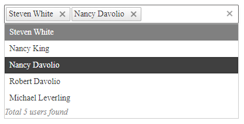

# Getting Started 

The following tutorial demonstrates how you can add a **RadMultiSelect** control populated with static items. The end result will be similar to **Figure 1**:

>caption Figure 1: Basic RadMultiSelect configuration with static items

1. Add a **ScriptManager** control on a Web Form.

2. Add a **RadMultiSelect** control to the page, and set its properties:

    * `DataTextField` and `DataValueField` - set them to `text` and `value` when populated with MultiSelectItems.
    * Populate the `Items` collection with `MultiSelectItem` instances and set their properties:
        * `Text` - the text of the item.
        * `Value` - the value of the item.
    * `FooterTemplate` - you can set custom footer template to the **RadMultiSelect** popup here.
    * `Filter` - set it to "`Contains`" to enable generic filtering.
    * Set other properties like `Placeholder`, `DropDownHeight` and `Width` to control its appearance as desired.
    * *Optional*: Set the `AutoClose` property to **false** if you would like to keep the DropDown open upon selecting an item. This way you can select more items without the need top open it again. Set the `AutoClose` property to **true** to make the DropDown close as soon as you select an item from the list.
        
    The end result should be similar to the following:

    **ASPX**
    
        <telerik:RadMultiSelect ID="RadMultiSelect1" runat="server" DataTextField="text" DataValueField="value" Filter="Contains" Width="400px" Placeholder="Select attendees..." AutoClose="false">
            <Items>
                <telerik:MultiSelectItem Text="Steven White" Value="1"></telerik:MultiSelectItem>
                <telerik:MultiSelectItem Text="Nancy King" Value="2"></telerik:MultiSelectItem>
                <telerik:MultiSelectItem Text="Nancy Davolio" Value="3"></telerik:MultiSelectItem>
                <telerik:MultiSelectItem Text="Robert Davolio" Value="4"></telerik:MultiSelectItem>
                <telerik:MultiSelectItem Text="Michael Leverling" Value="5"></telerik:MultiSelectItem>
            </Items>
            <FooterTemplate>
                
                    Total #: instance.dataSource.total() # users found
                
            </FooterTemplate>
        </telerik:RadMultiSelect>

