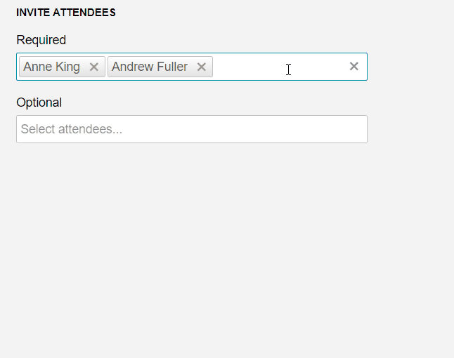

# MultiSelect Overview

**RadMultiSelect** is available as of R1 2020 and it is a server-side WebForms wrapper over the [MultiSelect for Kendo UI](https://docs.telerik.com/kendo-ui/controls/editors/multiselect/overview) for jQuery widget.

It operates on the client, displays a list of options and allows multiple selections from this list. It provides full control over the rendering of items, selected values, and popup headers.

>caption Figure 1: RadMultiSelect allows the multiple selection of a predefined list of items

## Key Features

* Renders and operates on the client-side

* Built-in accessibility, WAI-ARIA, keyboard and RTL support

* Single and Multiple [Tag Options](), giving the ability to customize the way the selected values are displayed

* Client [templates]() for all components

* Built-in [grouping]() of the data

* [Virtualization]()

* Client or server [filtering]()

* Integration with both [client-side]() and server-side data sources

* Rich [client-side API]() and [events]()

* Option for keeping or closing the DropDown upon selecting an item. This is controlled throughout the AutoClose property, see [Getting Started]() section.

# See Also

 * [Overview demo](https://demos.telerik.com/aspnet-ajax/multiselect/overview/defaultcs.aspx)
